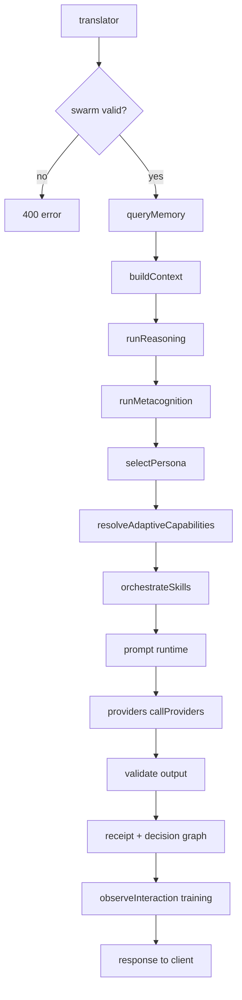

# DONER-FREE-AI — Global FREE AI Improvement, Hardening & Swarm Standard

## 0. FILE PURPOSE
This file serves as the unified global improvement standard, hardening specification, and release validation blueprint for the FREE AI gateway. It defines the mandatory hardening invariants, runtime validation rules, testing protocols, release gates, continuous assurance checks, blocked environment fallbacks, fallback harness parity audits, and agent workflows. It must be used by autonomous agents and human developers to evaluate, upgrade, verify, and report on any FREE AI-structured repository.

---

## 1. PROJECT IDENTITY SNAPSHOT TEMPLATE
Every project under evaluation or upgrade must record its identity snapshot using this exact fail-closed template at the top of its reports:
```markdown
================================================================================
PROJECT IDENTITY SNAPSHOT (FAIL-CLOSED)
================================================================================
- Project Name: "FREE AI" (or host project name if integrated)
- Project Version: "1.0"
- Project Code/ID: "UNKNOWN"
- Project Author/Owner: "UNKNOWN"
- Company: "UNKNOWN"
- Company Address: "UNKNOWN"
================================================================================
Identity Seal Status: SEALED/LOCKED
```
- Missing fields must remain `UNKNOWN`.
- No silent project renaming or speculative additions.

---

## 2. CANONICAL FREE AI STRUCTURE
A conformant FREE AI repository or its vendored submodule folder must match the following canonical structure:
- `src/server/` — HTTP endpoints, routers, and MCP routing modules.
- `src/providers/` — Provider adapters, ladders, budget guardians, and health matrices.
- `src/prompt/` — Output contracts, parsing, validation, and JSON repair systems.
- `src/control/` — Decision graphs and trace loggers.
- `src/memory/` — Memory vault, secure write validation, and decay manager.
- `src/improvement/` — Daemon prober and SleepCompute services.
- `scripts/` — Test runners, assurance verifiers, and catalog utilities.
- `tests/` — Post-hardening regression suites.
- `evidence/improvement-run/` — Dynamic evidence logs, receipts, and audits.
- `web/` — UI administration and monitoring dashboards.

---

## 3. CORE HARDENING INVARIANTS (VECTORS 1-9)
### Vector 1: Active Probing & Health Hardening
- **Daemon Prober**: Probing cycles must run out-of-band using non-overlapping `setTimeout` logic and `timer.unref()`, preventing event loop blocking.
- **Budget Guardian**: Provider costs checked synchronously via in-memory `memoryQuotaState` caches and `isUnderBudget(providerId)`. Flushes to disk must occur via async `fs.promises.writeFile`.
- **Health Matrix**: Failures trip exponential backoff starting at `30s * 2^(failures - 1)` up to a max cap of 1 hour, clearing immediately on a successful transaction.

### Vector 2: Auto-Repair Routing Integrity
- **Output Cap**: All model response payloads capped at a strict 5MB limit.
- **Extraction**: Extract JSON from truncated streams via index-based slice boundaries instead of costly regular expressions.
- **JSON Repair**: Bounded nested brace and bracket balancing inside `tryRepairJson`.
- **Threshold**: Cap repair cycles to 2 iterations max. Handoff to L2 or schema defaults if exhausted.
- **Stream Safety**: Writable streams cleaned up via try/catch, always calling `res.end()` guarded by `res.writableEnded`.

### Vector 3: Cognitive Trace Optimization
- **DecisionGraphLogger**: Dedicated class implementing a Write-Ahead Queue.
- **Trace I/O**: Flush logs out-of-band using async I/O to avoid request path latency.

### Vector 4: Admin Interface Security
- **File Access**: Prevent path traversal by rejecting null bytes (`\0`), enforcing a strict whitelist regex `/^[a-zA-Z0-9_.-]+\.json$/` on filenames, and matching startsWith prefixes on kindness paths and final paths.
- **Listing Caps**: List results limited to the top 100 most recent entries.
- **Dashboard**: Collapse transitions clear client memory (`innerText` resets) and loaded flags.

### Vector 5: Zero-Trust Memory Sandboxing
- **MemTrustGateway**: Cryptographically validates every memory write.
- **Cryptographic Bounds**: HMAC-SHA256 signatures validated via `crypto.timingSafeEqual` after checking buffer lengths. Reject invalid writes.

### Vector 6: Sleep-Time Compute & Consolidation
- **SleepComputeDaemon**: Background episodic consolidation runs only during idle phases, preventing user latency spikes.

### Vector 7: Decay-Driven Memory Activation
- **DecayManager**: Ebbinghaus exponential decay scoring rules based on interaction importance and elapsed days, pruning low-value items.

### Vector 8: Native Model Context Protocol (MCP) Orchestration
- **McpRouter**: Secure endpoints mounted under `/v1/mcp/list` and `/v1/mcp/execute` with capability schema matching and credentials containment.

### Vector 9: Fallback Harness & Parity Validation
- **Probe**: `execution_capability_probe.json` evaluates native shell execution capabilities.
- **Modes**: Support for `POST_HARDENING_TEST_MODE` values: `auto`, `child`, `in_process`, and `parity` (`PARITY_CHECK`).
- **ESM Fallback**: custom ESM-compatible `in_process_harness.js` simulating the core test block behaviors (`describe`, `it`, hooks).
- **Parity Reports**: Dynamic rewrite attestation and output comparison logs (`fallback_parity_report.json`).

---

## 4. RUNTIME INTEGRATION REQUIREMENTS
- `src/server.js`:
  - `McpRouter` instantiated and routes mounted.
  - Startup calls `SleepComputeDaemon.start()` during `server.listen`.
  - Core `/v1/infer` path remains intact.
- `src/memory/store.js`:
  - Imports `MemTrustGateway` and `DecayManager`.
  - Memory write paths wrapped with cryptographic attestation.
- `src/server/router.js`:
  - Enforce two-iteration repair limit.
  - Stream completion handlers guarded against writing to ended sockets.
- `src/server/admin.js`:
  - Rejection of null-byte and non-conformant filenames.
  - Listings capped at 100 items.
- `src/prompt/contracts.js`:
  - 5MB limit and brace-balanced JSON repair.

---

## 5. POST-HARDENING TEST SUITES
Every repository must ship with these 6 core test suites under `tests/`:
1. `tests/post_hardening_resilience.test.js`: Validates exponential backoff and budget guardians.
2. `tests/post_hardening_contracts_router.test.js`: Validates stream safety and repair boundaries.
3. `tests/post_hardening_decision_graph.test.js`: Validates out-of-band trace log queues.
4. `tests/post_hardening_admin.test.js`: Validates path traversal controls.
5. `tests/post_hardening_memory.test.js`: Validates zero-trust HMAC writes and decay.
6. `tests/post_hardening_mcp.test.js`: Validates MCP routers.
- Run using Node's native test runner: `node --test`.

---

## 6. RELEASE GATE RUNNER STANDARD
- Executed via `scripts/run_all_tests.js`.
- Rules:
  - If a test is missing, fail closed.
  - If a test fails, fail closed.
  - If environment child processes are blocked, fail closed unless the in-process fallback harness verifies all test suites pass.
  - If 0 tests are executed, fail closed.
- Execution status values recorded: `EXECUTED_PASS`, `EXECUTED_FAIL`, `BLOCKED_ENVIRONMENT`, `NOT_EXECUTED`.
- Release states: `GREEN`, `DEGRADED`, `BLOCKED_ENVIRONMENT`, `CRITICAL`.
- Required artifacts:
  - `evidence/improvement-run/run_header.json`
  - `evidence/improvement-run/test_file_hashes.json`
  - `evidence/improvement-run/post_hardening_test_receipt.json`
  - `evidence/improvement-run/post_hardening_test_transcript.txt`
  - `evidence/improvement-run/post_hardening_verification.md`
  - `evidence/improvement-run/final_release_gate_report.md`

---

## 7. CONTINUOUS ASSURANCE STANDARD
- Executed via `scripts/verify_assurance.js`.
- Invariant presence checks:
  - Scans `package.json` for required scripts.
  - Scans `src/server.js`, `src/memory/store.js`, `src/prompt/contracts.js` for mandatory code invariants.
  - Verifies evidence freshness (less than 24 hours).
  - Performs hash drift checks against signed baselines in `assurance_manifest.json`.
  - Runs secret scanning for keys/tokens.
- Required artifacts:
  - `evidence/improvement-run/assurance_discovery.json`
  - `evidence/improvement-run/assurance_manifest.json`
  - `evidence/improvement-run/continuous_assurance_report.json`
  - `evidence/improvement-run/continuous_assurance_report.md`

---

## 8. BLOCKED ENVIRONMENT CLOSURE STANDARD
- Probes execution capabilities using child process test forks.
- Writes findings to `evidence/improvement-run/execution_capability_probe.json`.
- Modes supported by `POST_HARDENING_TEST_MODE`:
  - `auto`: Automatically select child-process or in-process.
  - `child`: Force child process execution.
  - `in_process`: Force in-process fallback harness.
  - `parity`: Run in dual mode, validating output consistency.
- If child processes are blocked, the runner falls back to `in_process` execution to guarantee verification.

---

## 9. FALLBACK HARNESS PARITY & RELEASE PROOF STANDARD
- **Capability Matrix**: Map supported `node:test` APIs in `evidence/improvement-run/fallback_harness_capability_matrix.json`.
- **Inventory**: AST-scan test files to count constructs (`describe`, `it`, etc.) and output `fallback_construct_inventory.json` / `.md`.
- **Fail-Closed**: Exit immediately if any unsupported construct is used.
- **ESM Rewriting**: Programmatically rewrite test files at execution time to import the custom in-process harness, storing attestation hashes in `fallback_rewrite_attestation.json`.
- **Self-Tests**: Run harness validation and output `fallback_harness_selftest_report.json` / `.md`.
- **Parity**: Dual execution output comparisons are recorded in `fallback_parity_report.json` / `.md`.

---

## 10. GLOBAL EVIDENCE REQUIREMENTS
- All evidence must be saved in `evidence/improvement-run/`.
- Must contain SHA-256 signatures, UTC timestamps, and exact command transcripts.
- Strict secret scrub: No credentials, tokens, or private keys allowed in logs.

---

## 11. PACKAGE SCRIPT STANDARD
Conformant projects must register:
- `"test:post-hardening": "node scripts/run_all_tests.js"`
- `"verify:post-hardening": "node scripts/run_all_tests.js"`
- `"verify:assurance": "node scripts/verify_assurance.js"`
- `"release:verify": "npm run test:post-hardening && npm run verify:assurance"`

---

## 12. GLOBAL AGENT EVALUATION WORKFLOW
Future agents must follow this sequential execution loop:
1. **Inspect Repo**: Analyze directory structures and dependencies.
2. **Inventory Files**: Identify existing files and verify integrity.
3. **Compare**: Map findings against `DONER-FREE-AI.md`.
4. **Gap Analysis**: Create `doenr_gap_analysis.json` and `.md`.
5. **Upgrade**: Apply missing files and code blocks additively.
6. **Execute Tests**: Run `npm run test:post-hardening`.
7. **Run Assurance**: Run `npm run verify:assurance`.
8. **Fallback/Parity**: Execute in-process or parity checks if native child process is blocked.
9. **Emit Evidence**: Write all receipts to `evidence/improvement-run/`.
10. **Autonomy Score**: Score the repository based on verification results.
11. **Final Report**: Generate `doenr_final_upgrade_report.md`.

- **Fail-closed rules**:
  - No `GREEN` verdict if tests are unexecuted or missing.
  - No `GREEN` verdict with stale evidence.
  - No `GREEN` verdict with unsupported fallback constructs.
  - No `GREEN` verdict with missing parity evidence when parity is required.
  - No `GREEN` verdict with broken runtime invariants.

---

## 13. AUTONOMY SCORING
- **100/100**: Native or fallback execution passes fully, continuous assurance is clean, and runtime invariants are intact.
- **98/100**: Native execution blocked, fallback runner executes all tests successfully, trust artifacts are complete, and parity is documented.
- **95/100**: Implementation complete, but verification evidence is partially blocked or truncated.
- **90/100**: Implementation complete, but strict environments prevent full execution loops.
- **Below 80/100**: Critical failure (failed tests, missing files, broken invariants, stale evidence, or hash drift).

---

## 14. FINAL REPORT TEMPLATE
```markdown
# DOENR Evaluation & Hardening Report

## EXECUTION SUMMARY
Final Assurance Verdict: 🟢 **GREEN** / 🔴 **CRITICAL** / 🟡 **DEGRADED** / 🔵 **BLOCKED_ENVIRONMENT**

## Project Identity Snapshot
================================================================================
PROJECT IDENTITY SNAPSHOT (FAIL-CLOSED)
================================================================================
- Project Name: "<Name>"
- Project Version: "<Version>"
- Project Code/ID: "<ID>"
- Project Author/Owner: "<Owner>"
- Company: "<Company>"
- Company Address: "<Address>"
================================================================================

## Verification Status
- Release Gate: PASS / FAIL / BLOCKED
- Assurance Gate: PASS / FAIL
- Fallback/Parity Status: ACTIVE / INACTIVE / PARITY_CHECK_OK

## Files Changed
- <File list>

## Commands Run
- <Commands list>

## Security Findings
- <Secret scanning & invariant violations>

## Autonomy Score
- **<Score>/100**

## Next Command for Architect
```

---

## 15. CROSS-PROJECT COMPLIANCE EVALUATOR STANDARD
The project must include an automated evaluator script under `scripts/evaluate_doner_standard.js` that checks target projects against this global standard.
- **Package Script Registration**: `"evaluate:doner": "node scripts/evaluate_doner_standard.js"`
- **Validation Checklist**:
  - Canonical files check: `DONER-FREE-AI.md` presence and `DOENR-FREE-AI.md` redirect integrity.
  - Directory check: Expected layout directories and core source modules.
  - Script check: Required package script entries.
  - Evidence checks: Presence of release receipts, continuous assurance logs, and fallback/parity evidence.
- **Scoring Scale (0–100)**:
  - 100/100: All folders, scripts, invariants, release evidence, assurance logs, and fallback parity files are present and valid.
  - 95–99: Core implementation complete, but optional parity evidence is missing due to env child-process blocks (clearly documented).
  - Below 80: Missing critical files, failed tests, stale logs, or broken invariants.
- **Blockers (Fail-Closed)**:
  - Missing `DONER-FREE-AI.md`.
  - `DOENR-FREE-AI.md` containing duplicate competing standards.
  - Missing `release:verify` script or `post_hardening_test_receipt.json`.
  - Non-PASS status in release gate receipt or continuous assurance report.
- **Required Outputs**:
  - `evidence/improvement-run/doner_cross_project_evaluation.json`
  - `evidence/improvement-run/doner_cross_project_evaluation.md`
  - `evidence/improvement-run/doner_upgrade_recommendations.md`

---

# LEGACY AND ORIGINAL SWARM BLUEPRINT SPECIFICATIONS
The following section contains the original, preserved swarm orchestration client blueprints, API payloads, schemas, and complete code annexes.

---

## 0. Start here (Lovable, v0, Bolt, internal handoff)

This blueprint is written so you can **upload it or paste chunks** into an AI-assisted product builder (e.g. Lovable) **or** give it to a human/agency as the only spec. The generated app is almost always a **browser UI + serverless or Node API**. FREE AI remains a **separate long-running Node process** (or container) with a **full local copy** of the engine — not a thin client SDK to “install from npm” as the whole engine.

### 0.1 What you can treat as “complete” in this file

| You need | Where it is |
|----------|-------------|
| Copy-only law, mandatory folders | **Section 1**, `AGENTS.md` in the vendored tree |
| HTTP contract for one worker + merge | **Section 4** (JSON bodies), **12.20** (OpenAPI fragment) |
| Working fetch + retry + parallel fan-out | **12.1** `lib.mjs` (matches `examples/swarm_host_orchestrator/` in repo) |
| Provider ladder, pins, catalog refresh | **6**, **12.12–12.18** |
| Graph swarm | **5**, **12.19–12.19b**, **12.23** |
| Metacognition, training, adaptive skills | **15–16** |
| Commands that prove the copy works | **Section 8** |

If a platform’s AI **cannot** run `node` on your vendored tree, **you** still run section 8 locally or in CI; do not treat “UI builds” as proof the engine works.

### 0.2 Same-day path (minimal decisions)

1. Vendor the **entire** engine per **section 1** (no partial copy).
2. Start the engine: from engine root, `npm install` then `node src/server.js` (or `PORT=3000` as you prefer).
3. Implement **Pattern A** only at first: three **`POST /v1/infer`** shapes from **section 4** (two workers + one merge).
4. Reuse **12.1** in your host repo (or call the example CLI in **12.2** against your `BASE_URL`).
5. Run **section 8** until exit code **0**; for full gate including smoke + optional swarm demo: set `FREEAI_SWARM_DEMO_IN_GATE=1` and run **without** `--fast` (see **0.5**).

### 0.3 Reference architecture (generated frontend + FREE AI)

Use this mental picture when Lovable (or similar) produces React and API routes:

```text
Browser (generated UI)
  → HTTPS
Host backend (session, rate limits, YOUR business logic)
  → private HTTP
FREE AI (vendored `src/server.js` — translator → … → providers → receipts)
  → OpenRouter / Groq / Gemini / Ollama / …
```

- **Never** put cloud LLM API keys or `FREEAI_INFER_API_KEY` in client-side env exposed to the browser if you care about abuse.
- **Swarm merge policy** (which worker wins, judge model, etc.) is **host-owned** in Pattern A; the engine still validates `swarm` fields and can emit rollup receipts when you use `fan_in` (see **4.4**).

### 0.4 Environment variables (cheat sheet)

| Concern | Variables (representative) | Detail |
|--------|-----------------------------|--------|
| Engine providers | `OPENROUTER_API_KEY`, `GROQ_API_KEY`, `GEMINI_API_KEY`, `OLLAMA_ENDPOINT`, … | Full set in **`.env.example`** at engine root |
| Listen port | `PORT` | Host BFF must target the same base URL |
| Mode | `FREEAI_MODE`, `NODE_ENV` | See `src/config.js` / docs |
| Lock infer + admin (production-style) | `FREEAI_REQUIRE_INFER_TOKEN`, `FREEAI_INFER_API_KEY`, `ADMIN_API_KEY`, `FREEAI_CORS_ALLOW_ORIGINS` | **Section 7**, `docs/ENTERPRISE_DEPLOY.md` |
| Metrics JSONL path | `FREEAI_METRICS_JSONL` | Default under `data/` if unset |
| Quality gate: run swarm demo inside gate | `FREEAI_SWARM_DEMO_IN_GATE=1` | Only when **not** using `--fast`; see **0.5** |

### 0.5 Verification commands (bash and Windows)

From the **engine root** (the vendored folder):

```bash
node scripts/quality_gate.js --fast
node scripts/run_all_tests.js
npm run swarm-demo
```

Full gate (includes **smoke**; needs port **3311** free per project docs). Optional: also run the swarm demo script inside the gate:

```bash
export FREEAI_SWARM_DEMO_IN_GATE=1   # omit if you do not want swarm_demo in gate
node scripts/quality_gate.js
```

PowerShell (Windows):

```powershell
node scripts/quality_gate.js --fast
node scripts/run_all_tests.js
npm run swarm-demo
$env:FREEAI_SWARM_DEMO_IN_GATE = '1'
node scripts/quality_gate.js
```

Treat **`quality_gate.js` without `--fast`** as the stronger bar when port 3311 is available; **`--fast`** skips smoke by design.

### 0.6 Paste order for an AI app builder (Lovable prompt pack)

Paste in this order so the model keeps boundaries straight:

1. **Section 0** (this section) + **section 1** — copy-only and no upstream runtime dependency.
2. **Section 4** — exact JSON for workers and fan-in merge.
3. **12.20** — OpenAPI fragment for your gateway or route stubs.
4. **12.1** — `lib.mjs` as the reference HTTP client (traceparent, retries).
5. One line of instruction: *“Proxy `prompt`, `intent_family`, and `swarm` to the engine; do not reimplement translator, personas, or provider routing in the BFF.”*

### 0.7 Document map (all major sections)

**0** Start here (Lovable / cloud) — **1** Non-negotiables — **2** Mental model — **3** Pattern A vs B — **4** Host swarm step-by-step — **5** Engine graph swarm — **6** Free tiers and catalog uplift — **7** Security — **8** Verification — **9** Host deliverables — **10** Glossary — **11** Canonical read order — **12** Code annex — **13** Large files to copy from tree — **14** RAG / memory — **15** Intelligence stack — **16** Metacog / reasoning / observer / acquisition verbatim.

In GitHub or many IDEs, open the **document outline** / table-of-contents for this file to jump to numbered sections.

### 0.8 What no generator replaces

- A **full** vendored **FREE AI** tree (`AGENTS.md` mandatory copy set).
- Writable runtime dirs: `data/`, `memory/`, `evidence/`, `acquisition/`.
- Your decision: **Pattern A** (host orchestration) vs **Pattern B** (DAG in engine), documented for the team.

---

## 1. Non-negotiables before you write code

1. **Copy the entire engine** into the destination repository under a dedicated folder (examples: `vendor/free-ai/`, `engines/free-ai/`, `src/freeai/`). Partial copies break validation, receipts, evidence, personas, skills, and routing. Authoritative policy: `docs/COPY_ONLY_EMBED_POLICY.md` and `AGENTS.md` (“Mandatory Copy Set”).
2. **Do not** depend on this source repo at runtime: no `git submodule`, no symlink to another checkout, no `npm` dependency pointing at upstream FREE AI, no shared HTTP “wrapper” service used by multiple products.
3. **Behavioral source of truth** inside the copied tree: `FREEAI.md` (normative architecture, including swarm) plus `src/`, `providers.json`, `freeai.engine.manifest.json`, `personas/`, `skills/`, schemas, scripts, tests.
4. After merge, **only the embedded copy** defines behavior; refreshing upstream is a deliberate re-copy and re-verification, not `npm update`.

---

## 2. How FREE AI is organized (mental model)

FREE AI is a **local Node engine** that runs a fixed **cognitive pipeline** before every provider call: translator → context → memory hooks → reasoning/persona/skill orchestration → prompt runtime → **provider routing** → response → **receipts** → evidence paths. Swarm workers are **not a separate runtime**: each worker turn is a normal inference with extra **swarm metadata** on the JSON body (and optional graph execution for DAG mode).

**Primary HTTP surfaces**

| Surface | Method | Role |
|--------|--------|------|
| Single turn / worker | `POST /v1/infer` | One pipeline execution; use this for each swarm worker and for fan-in merge calls. |
| Streaming | `GET /v1/stream` or POST streaming paths per deploy | Same stack; prefer POST where prompts must not land in query strings (enterprise note in `AGENTS.md`). |
| Graph swarm (optional) | `POST /v1/swarm/run` | Engine-validated DAG (`prompt_node`, `merge_node`, `finalization_node`, plus v3+ node types). Host still owns product-level scheduling if workers are external processes. |
| Health | `GET /health`, `/health/live`, `/health/ready`, `/health/startup` | Liveness for orchestrators and load balancers. |

**Mandatory directories and roots** (from `AGENTS.md`): `src/`, `skills/`, `personas/`, `tests/`, `scripts/`, `web/`, `data/`, `memory/`, `evidence/`, `acquisition/`, plus `providers.json`, `.env.example`, `package.json`, `AGENTS.md`, `freeai.engine.manifest.json`, `README.md`, `FREEAI.md`.

**Key implementation files for this blueprint**

| Concern | Location |
|--------|----------|
| Swarm field semantics (host) | `docs/POST_ENTERPRISE_EXTENSIONS.md` |
| Normative swarm orchestration text | `FREEAI.md` §19–§22 |
| JSON Schemas | `src/schemas/assignmentContext.v1.json`, `src/schemas/swarmFanInRollup.v1.json` |
| Host reference client (3-step demo) | `examples/swarm_host_orchestrator/lib.mjs`, `README.md` |
| One-command runnable demo | `npm run swarm-demo` — `SWARM_DEMO.md` |
| Graph contract | `docs/SWARM_GRAPH_CONTRACT_V1.md`, `docs/SWARM_RUNTIME_V1.md` … `V5` as applicable |
| Graph validation (always on) | `src/server/validation/validateSwarmRunRequest.js` |
| Fan-in rollup file writer | `src/swarm/receiptAggregate.js` (`writeSwarmRollupReceipt`) |
| Provider try-order and adapters | `src/providers/registry.js`, `src/providers/ladder.js`, adapters under `src/providers/*Adapter.js` |
| Model policy modes | `src/config.js`, `src/routing/modelSelectionPolicy.js`, `src/routing/selectModelCandidate.js` |
| Catalog refresh | `scripts/refresh_model_catalog.js`, `docs/MODEL_CATALOG_REFRESH.md` |
| Metacognition | `src/metacog/index.js` (verbatim §16.1) |
| Reasoning + acquisition hints | `src/cognitive/reasoning.js` (verbatim §16.2) |
| Adaptive capability generation | `src/capability/acquisition.js` (verbatim §16.4), `src/capability/research.js` |
| Training / self-improvement | `src/training/observer.js` (§16.3), `src/training/engine.js`, `data/training/` |

---

## 3. Two valid “swarm” implementations (choose explicitly)

### 3.1 Pattern A — Host orchestrator + repeated `POST /v1/infer` (recommended for cross-repo agents)

**What the engine does:** Executes **one** full pipeline per HTTP request.

**What the host does:** Owns the **task graph**: parallel calls for `researcher`, `coder`, optional additional workers, deadlines, retries, and **merge policy**. This matches FREE AI’s documented non-goal: the engine does not run LangGraph-style schedulers for arbitrary external workers.

**Canonical “three AIs” pattern:** Three **roles** in one logical `swarm.task_id`:

1. **Researcher** — `swarm.role: "researcher"` → default persona `swarm_role_researcher` (unless you override `persona` on the body).
2. **Coder** — `swarm.role: "coder"` → `swarm_role_coder`.
3. **Reviewer / synthesizer** — `swarm.role: "reviewer"` on the fan-in call; used for merge preview or finalization. Persona file: `swarm_role_reviewer.json`.

Each call is independent for routing: **each** may traverse **multiple providers** (OpenRouter, Groq, Ollama, Gemini, …) according to `providers.json`, health, cooldowns, and model policy. That is the **fallback orchestration across backends**, not “three separate AI products” in code — three **pipeline invocations** with role-tagged envelopes.

Reference implementation of the HTTP sequence (including `fan_in`, `child_trace_ids`, `merge_strategy`, `preview_only` on merge): `examples/swarm_host_orchestrator/lib.mjs` function `runSwarmFanoutDemo` — **parallel** researcher/coder by default (`Promise.all`), per-worker `traceparent`, optional `opts.parallel: false` for strict ordering, and jittered retry backoff for smoother behavior under rate limits.

### 3.2 Pattern B — Engine graph `POST /v1/swarm/run`

**What the engine does:** Validates and executes a **DAG** of nodes inside the engine process (v1–v2 linear/merge/finalization; v3+ adds human review gates, tool nodes, policy fabric, replay/resume — see `docs/SWARM_RUNTIME_V3.md` and later version docs).

**When to use:** You want **durable run records** under `data/swarm_runs/` (by default), admin inspection (`/admin/swarm-runs`, …), and graph-level receipts — still **without** the engine becoming your global multi-tenant job queue.

**Important:** Strict validation is **always on** for this route; malformed graphs return **400** with `errors[]`. Same infer-token gate as `/v1/infer` when `FREEAI_REQUIRE_INFER_TOKEN` (or related production profile) is enabled.

**Compatibility:** v3 auto-detects v3-only node types; v1/v2 graphs run unchanged. See `README.md` swarm paragraph for the admin surface list.

---

## 4. End-to-end: Host-owned three-role swarm (Pattern A)

This section is sufficient for another agent to implement the orchestration **without asking clarifying questions**, assuming the engine is already copied and starts successfully.

### 4.1 Preconditions

- Node.js **18+** on the host and inside CI.
- Writable directories: `data/`, `memory/`, `evidence/`, `acquisition/` (relative to engine cwd when you start `src/server.js`).
- `providers.json` in the engine root: mark providers `enabled: true` only when keys or endpoints exist; otherwise the ladder skips them.
- Optional keys (typical): `OPENROUTER_API_KEY`, `GROQ_API_KEY`, `GEMINI_API_KEY`, `OLLAMA_ENDPOINT`, etc. — see `.env.example` in the engine tree.

### 4.2 Stable correlation identifiers

For every logical swarm task:

- **`swarm.task_id`:** Same string on **all** worker and merge requests for that task. Use a UUID or deterministic id from your workflow engine.
- **`swarm.agent_id`:** Unique per worker instance (`"a1"`, `"a2"`, `"merge"`, …).
- **`traceparent` header (W3C):** Generate or propagate on **every** `POST /v1/infer`. FREE AI correlates `trace_id` across receipts and metrics; fan-in should pass **`swarm.child_trace_ids`** listing prior workers’ `receipt.trace_id` values for observability (`docs/POST_ENTERPRISE_EXTENSIONS.md`).

### 4.3 Request body skeleton (per worker)

```json
{
  "prompt": "<role-specific instruction including any prior outputs you want in context>",
  "intent_family": "swarm_task",
  "swarm": {
    "task_id": "<same across workers>",
    "agent_id": "<unique per call>",
    "role": "researcher|coder|reviewer",
    "subtask_goal": "<optional short goal string>"
  }
}
```

Optional overrides your orchestrator may add:

- **`persona`:** Explicit persona id if you do not want the default `swarm_role_<role>`.
- **`skills` / skill selection:** If your host packs additional skill ids consistent with `skills/active_catalog.json`.
- **`timeout`:** Milliseconds for provider attempts (router default commonly 15000 unless overridden per payload).

### 4.4 Fan-in (merge) call

After workers return JSON, the host performs **merge logic** (FREE AI does not pick the winning text for you in Pattern A). The engine can still emit a **rollup receipt artifact** when you set:

```json
{
  "prompt": "<merge instruction; include worker outputs>",
  "intent_family": "swarm_task",
  "preview_only": true,
  "swarm": {
    "task_id": "<same>",
    "agent_id": "merge",
    "role": "reviewer",
    "fan_in": true,
    "child_trace_ids": ["<trace_id_worker_1>", "<trace_id_worker_2>"],
    "merge_strategy": "primary_wins"
  }
}
```

`merge_strategy` and `child_trace_ids` are defined in the enterprise extensions doc; rollup persistence is implemented in `src/swarm/receiptAggregate.js` (files under `evidence/receipts/` named with `swarm-rollup-` prefix).

**Merge strategies** (document in your host; normative table in `FREEAI.md` §19.4): e.g. primary wins, longest/most complete, optional judge model. Record `partial_merge: true` when some workers fail.

### 4.5 Failure and retry semantics (host + engine)

- **Per-request provider fallback:** Inside a **single** `POST /v1/infer`, `ProviderRegistry.callProviders` walks **eligible** providers (enabled, not in cooldown), ordered by an internal score, and for each provider tries **model candidates** in order (`pinnedModel`, then `candidates[]`, possibly reordered by catalog policy — see §6). Failures record capability/usage and may apply cooldowns before the next provider.
- **429 / 5xx / network:** Your host should wrap fetch with **timeouts and bounded retries** like `inferWithRetry` in `examples/swarm_host_orchestrator/lib.mjs`. Backoff there is illustrative; tune for your SLOs.
- **Exhausted providers:** Router path can fall back to **local KB / survival** answer with `fallback_used: true` in the receipt (see `src/server/router.js` — behavior is intentional for resilience).
- **Subtask retries (swarm):** `FREEAI.md` §19.3: retries may change **provider** but keep persona/skills unless the orchestrator **explicitly** escalates (e.g. add debug-oriented skills).

### 4.6 Minimal host pseudo-flow (language-agnostic)

```
START(task)
  task_id = new_id()
  PARALLEL:
    R = POST /v1/infer { intent_family: swarm_task, swarm: { task_id, agent_id: "r1", role: researcher }, prompt: P_r }
    C = POST /v1/infer { intent_family: swarm_task, swarm: { task_id, agent_id: "c1", role: coder }, prompt: P_c }
  WAIT R, C
  child_traces = [R.receipt.trace_id, C.receipt.trace_id]
  M = POST /v1/infer { intent_family: swarm_task, preview_only: true, swarm: { task_id, agent_id: "merge", role: reviewer, fan_in: true, child_trace_ids: child_traces, merge_strategy: CHOSEN }, prompt: P_merge(R,C) }
  RETURN aggregate receipts { R, C, M }
END
```

Forward **`traceparent`** on each POST in production (example README notes the demo omits it for brevity).

### 4.7 Personas and skills (in-repo defaults)

- Personas: `personas/swarm_role_researcher.json`, `personas/swarm_role_coder.json`, `personas/swarm_role_reviewer.json`.
- Swarm-tagged skills: discover via `skills/active_catalog.json` (ids often prefixed `swarm_*`); used for scoring when `intent_family` is `swarm_task` (see `docs/POST_ENTERPRISE_EXTENSIONS.md`).

Do not delete or bypass these when you want stock swarm behavior; add **host-specific** personas/skills only by extending the copied `personas/` and `skills/` and respecting catalog validation.

---

## 5. Engine graph swarm (Pattern B) — skeleton

Use when the workflow maps cleanly to a **DAG** of prompt/merge/finalize nodes inside the engine.

1. Read `docs/SWARM_GRAPH_CONTRACT_V1.md` for the normative JSON body (`graph_id`, `graph_name`, `nodes`, `edges`, `entry_node_id`, `receipt_mode`, `input_payload`).
2. Ensure `entry_node_id` references a `prompt_node`; wire `edges` so merges see upstream outputs.
3. POST the graph to `/v1/swarm/run`; handle **400** validation vs **422** business failure vs **401** infer/admin auth.
4. For operations teams: use admin routes listed in `AGENTS.md` (`/admin/swarm-runs`, resume, reviews, checkpoints, …) per runtime version.

**Coexistence with Pattern A:** A large product may use **Pattern A** for distributed human+agent workers and **Pattern B** for an internal quality graph — document which subsystem uses which.

---

## 6. Free tiers, provider ladder, and “automated uplift” of models

### 6.1 Free-first routing (runtime)

`computeProviderLadder` (`src/providers/ladder.js`) buckets providers by `free_tier_class` (`primary_free`, `burst_free`, `starter_credit`, `low_cost_fallback`, `local_only`, …) and scores them with weight, health, quota reliability, rate-limit gates, and governance bonuses/penalties. `ProviderRegistry.callProviders` then sorts **eligible** providers and attempts adapters in order, iterating **models** per provider until success or exhaustion.

**Practical implication for swarm:** Each of the three role calls **automatically** benefits from the same ladder and multi-provider retries; you do not manually “pick Groq then OpenRouter” per role unless you add host-level pinning.

### 6.2 Model catalog refresh (automatable job)

Run **inside the vendored copy**:

```bash
node scripts/refresh_model_catalog.js
```

- **Outputs:** `data/model_control_plane/catalog_snapshot.json`, `data/model_control_plane/refresh_status.json`, diff artifacts under `evidence/catalog_refresh/` (see `docs/MODEL_CATALOG_REFRESH.md`).
- **Network skip for CI/air-gap:** `FREEAI_REFRESH_SKIP_NETWORK=1` uses static pins from `providers.json` without live provider discovery.
- **Fail-closed behavior:** Unreachable catalog sources mark providers degraded; pins from `providers.json` are still recorded when live sources fail.
- **Critical governance rule:** Refresh **never** edits `providers.json` and **never** silently promotes new models to production defaults.

### 6.3 “Automated uplift” — what actually happens

There are **two layers**; do not conflate them.

| Layer | What can automate | What does NOT auto-change |
|-------|---------------------|---------------------------|
| **Discovery** | Scheduled `refresh_model_catalog.js` discovers new vendor model ids and stores them with default `promotion_status: discovered` (not production-ready). | `pinnedModel` / `candidates` in `providers.json` |
| **Selection policy** | `FREEAI_MODEL_SELECTION_MODE` or `settings.json` → `model_selection_policy_mode` controls whether catalog rows can influence try-order. | Pins still win unless policy + catalog yield an applicable promoted/stable row (`docs/MODEL_SELECTION_POLICY.md`) |

**Modes** (`src/routing/modelSelectionPolicy.js`, `docs/MODEL_SELECTION_POLICY.md`):

- **`PINNED_ONLY` (default):** Try order matches `pinnedModel` then explicit `candidates[]` per provider — safest for reproducible production.
- **`LATEST_ALIAS_ALLOWED`:** Vendor `latest`-style ids may be considered only for explicitly sandbox-style lanes (e.g. `fast_chat` policy variant).
- **`AUTO_PROMOTE_GOVERNED`:** A catalog row must be **`promotion_status: promoted`** and **`status: stable`** before it can become an automatic choice; otherwise the pin wins. There is **no blind always-latest swap**.

**Operational cadence:** Use admin summaries (`/admin/model-catalog-summary`, `/admin/model-pins`, `/admin/model-promotion-history`, `/admin/model-refresh-status`) and your change control before switching modes or promoting rows (`docs/runbooks/model_catalog_refresh.md`, `docs/MODEL_GOVERNANCE_CADENCE.md`).

**Summary for stakeholders:** Free tiers “stay current” through **scheduled catalog refresh + governed promotion workflow**; production uplift is **deliberate**, not a silent overwrite on new upstream releases.

---

## 7. Security, enterprise gates, and observability

- **Infer token:** When `FREEAI_REQUIRE_INFER_TOKEN=1` (or production profile equivalents), send `Authorization: Bearer <FREEAI_INFER_API_KEY>` or `X-Infer-Key` on `/v1/infer` and `/v1/swarm/run`.
- **Admin API key:** Production-style profiles may require `ADMIN_API_KEY` for `/admin/*`.
- **CORS:** `FREEAI_CORS_ALLOW_ORIGINS` in production — see `docs/ENTERPRISE_DEPLOY.md` and `AGENTS.md` summary.
- **Tenant header:** `X-Tenant-Id` is correlation-only unless enterprise tenant enforcement is enabled (`docs/ENTERPRISE_GOVERNANCE_V3.md`).
- **Tracing:** Propagate W3C `traceparent` / `tracestate`; align with `FREEAI.md` §22 for swarm correlation.
- **Preflight script:** `node scripts/validate_enterprise_trust.js` when hardening deployments.

---

## 8. Verification checklist (run from engine root)

```bash
node scripts/quality_gate.js --fast
node scripts/run_all_tests.js
```

Optional full gate (includes smoke; needs port **3311** free per project docs):

```bash
node scripts/quality_gate.js
```

**Windows + optional swarm in gate:** see **§0.5** (`FREEAI_SWARM_DEMO_IN_GATE` and PowerShell).

Swarm-specific runnable proof:

```bash
npm run swarm-demo
```

Expect: server on random port **3400–3799**, three successful `POST /v1/infer` calls, printed trace ids and merge `receipt.swarm` (`SWARM_DEMO.md`).

Integration kit for handoff to other repos:

```bash
node scripts/build_integration_kit.js
```

Use generated `out/integration-kit/HOST_MERGE_GUIDE.md` and `AGENT_TRANSFER_PROMPT.md` alongside **this** blueprint.

---

## 9. Deliverables the implementing agent should produce in the host project

1. **Vendored engine folder** satisfying `AGENTS.md` mandatory copy set.
2. **Host orchestrator module** implementing Pattern A (or graph client for Pattern B) with: shared `task_id`, distinct `agent_id`s, `traceparent` propagation, timeouts/retries, merge policy, and persistence of receipts your product needs.
3. **Configuration:** `.env` for keys; `providers.json` edited only deliberately; optional `settings.json` keys such as `model_selection_policy_mode` aligned with org policy.
4. **CI:** `quality_gate.js --fast` (or stricter) on the embedded path; optional `FREEAI_SWARM_DEMO_IN_GATE=1` if you wire swarm demo into gate (`docs/QUALITY_GATE_CI.md`).
5. **Runbooks:** When to run catalog refresh; who approves promotion; rollback via `PINNED_ONLY` + pin restore.

---

## 10. Glossary

| Term | Meaning |
|------|---------|
| **Host** | Your application repository that embeds FREE AI and issues HTTP (or in-process) calls. |
| **Pattern A** | Host swarm: multiple `/v1/infer` calls + host merge. |
| **Pattern B** | Engine swarm graph: `POST /v1/swarm/run`. |
| **Three AIs** | In this blueprint: the three **swarm roles** (researcher, coder, reviewer), each a full pipeline call — not three hard-coded vendor APIs. |
| **Provider ladder** | Ordering and scoring of backends for free-first multi-provider attempts. |
| **Uplift** | Discovery + optional governed catalog promotion; **not** silent pin mutation. |

---

## 11. Canonical doc index (read order for the next agent)

0. **This file §0–§4** — cloud-builder handoff, architecture, and Pattern A JSON before you read normative SSOT (skip if you already embedded the engine and only need `FREEAI.md`).
1. `AGENTS.md` — integration law and endpoint list
2. `freeai.engine.manifest.json` — product identity and surface hints
3. `FREEAI.md` §19–§22 — swarm + observability
4. `docs/POST_ENTERPRISE_EXTENSIONS.md` — payload table
5. `docs/COPY_ONLY_EMBED_POLICY.md` — legal embedding pattern
6. `docs/MODEL_CATALOG_REFRESH.md` + `docs/MODEL_SELECTION_POLICY.md` — catalog and uplift governance
7. `examples/swarm_host_orchestrator/` — working HTTP shapes
8. `SWARM_DEMO.md` — one-command verification
9. `docs/SWARM_GRAPH_CONTRACT_V1.md` + `docs/SWARM_RUNTIME_V*.md` — graph mode
10. `FREEAI.md` Part B — translator, context, personas, skills, metacognition; plus **this file sections 15–16** for pipeline order, training loop, and verbatim metacog / reasoning / observer / adaptive acquisition code
11. `docs/SWARM_TOOL_NODE.md` — tool and retrieval nodes in graphs

---

## 12. Complete code annex (verbatim copies from this repository)

Everything below is **paste-ready** from the FREE AI tree at the time this document was assembled. Paths are relative to the **engine root** (the vendored folder). If line numbers drift after upstream edits, use `git show` / file search in your copy.

### 12.1 Host orchestrator — `examples/swarm_host_orchestrator/lib.mjs`

```javascript
/**
 * Minimal host-side client: traceparent, timeout, bounded retries.
 * Copy-only; not published as an npm package.
 */
import crypto from 'crypto';

function sleep(ms) {
  return new Promise((r) => setTimeout(r, ms));
}

/** Small jitter so concurrent clients do not retry in lockstep (smoother under rate limits). */
function retryBackoffMs(attempt) {
  const base = Math.min(2000, 200 * 2 ** attempt);
  return base + Math.floor(Math.random() * 120);
}

/** W3C traceparent 00-{32 hex trace}-{16 hex span}-01 */
export function makeTraceparent() {
  const traceId = crypto.randomBytes(16).toString('hex');
  const spanId = crypto.randomBytes(8).toString('hex');
  return { traceparent: `00-${traceId}-${spanId}-01`, traceId, spanId };
}

/**
 * POST /v1/infer with optional traceparent and retries on 429 / 5xx / network abort.
 * @param {string} baseUrl e.g. http://127.0.0.1:3311
 * @param {object} body JSON body
 * @param {{ timeoutMs?: number, maxRetries?: number, traceparent?: string }} [opts]
 */
export async function inferWithRetry(baseUrl, body, opts = {}) {
  const timeoutMs = opts.timeoutMs ?? 45_000;
  const maxRetries = opts.maxRetries ?? 2;
  const traceparent = opts.traceparent ?? makeTraceparent().traceparent;
  let last = null;

  for (let attempt = 0; attempt <= maxRetries; attempt += 1) {
    const ac = new AbortController();
    const timer = setTimeout(() => ac.abort(), timeoutMs);
    try {
      const r = await fetch(`${baseUrl.replace(/\/$/, '')}/v1/infer`, {
        method: 'POST',
        headers: {
          'Content-Type': 'application/json',
          traceparent,
        },
        body: JSON.stringify(body),
        signal: ac.signal,
      });
      clearTimeout(timer);
      const json = await r.json().catch(() => ({}));
      if (r.status === 429 || (r.status >= 500 && r.status < 600)) {
        last = { ok: r.ok, status: r.status, json, traceparent };
        await sleep(retryBackoffMs(attempt));
        continue;
      }
      return { ok: r.ok, status: r.status, json, traceparent };
    } catch (e) {
      clearTimeout(timer);
      last = e;
      if (attempt < maxRetries) await sleep(retryBackoffMs(attempt));
    }
  }
  if (last && typeof last.status === 'number') return last;
  throw last;
}

/**
 * Three-step fan-out + fan-in (preview merge). Returns structured result for demos/tests.
 * @param {string} baseUrl
 * @param {string} [taskId] defaults to time-based id
 * @param {{ parallel?: boolean }} [opts] parallel workers (default true) for lower latency / less wall-clock work vs sequential
 */
export async function runSwarmFanoutDemo(baseUrl, taskId = `demo-task-${Date.now()}`, opts = {}) {
  const parallel = opts.parallel !== false;
  const body1 = {
    prompt: 'Researcher: list two unknowns about topic X.',
    intent_family: 'swarm_task',
    swarm: { task_id: taskId, agent_id: 'a1', role: 'researcher' },
  };
  const body2 = {
    prompt: 'Coder: propose minimal API shape for merging two text blobs.',
    intent_family: 'swarm_task',
    swarm: { task_id: taskId, agent_id: 'a2', role: 'coder' },
  };
  const tp1 = makeTraceparent();
  const tp2 = makeTraceparent();

  let w1;
  let w2;
  if (parallel) {
    [w1, w2] = await Promise.all([
      inferWithRetry(baseUrl, body1, { traceparent: tp1.traceparent }),
      inferWithRetry(baseUrl, body2, { traceparent: tp2.traceparent }),
    ]);
  } else {
    w1 = await inferWithRetry(baseUrl, body1, { traceparent: tp1.traceparent });
    w2 = await inferWithRetry(baseUrl, body2, { traceparent: tp2.traceparent });
  }
  const traceA = w1.json?.receipt?.trace_id;
  const traceB = w2.json?.receipt?.trace_id;
  const merge = await inferWithRetry(baseUrl, {
    prompt: 'Fan-in placeholder: prior workers produced partial outputs; summarize conflicts only.',
    intent_family: 'swarm_task',
    preview_only: true,
    swarm: {
      task_id: taskId,
      agent_id: 'merge',
      role: 'reviewer',
      fan_in: true,
      child_trace_ids: [traceA, traceB].filter(Boolean),
      merge_strategy: 'primary_wins',
    },
  });
  return {
    taskId,
    workerA: { ok: w1.ok, status: w1.status, trace_id: traceA, traceparent: w1.traceparent },
    workerB: { ok: w2.ok, status: w2.status, trace_id: traceB, traceparent: w2.traceparent },
    merge: {
      ok: merge.ok,
      status: merge.status,
      trace_id: merge.json?.receipt?.trace_id,
      receipt_swarm: merge.json?.receipt?.swarm ?? null,
    },
  };
}
```

### 12.2 Host CLI — `examples/swarm_host_orchestrator/example_fanout.mjs`

```javascript
/**
 * Illustrative host client: not production merge logic.
 * Usage: BASE_URL=http://127.0.0.1:3000 node example_fanout.mjs
 */
import { runSwarmFanoutDemo } from './lib.mjs';

const base = process.env.BASE_URL || 'http://127.0.0.1:3000';
const taskId = process.env.SWARM_TASK_ID || `demo-task-${Date.now()}`;
const out = await runSwarmFanoutDemo(base, taskId);
console.log(JSON.stringify(out, null, 2));
```

### 12.3 CI / local demo driver — `scripts/swarm_demo.js`

```javascript
#!/usr/bin/env node
/**
 * Starts FREE AI on an ephemeral port, runs fan-out + fan-in preview, prints summary, exits.
 * Usage (from engine root): node scripts/swarm_demo.js
 */
import { spawn } from 'child_process';
import fs from 'fs';
import path from 'path';
import { fileURLToPath } from 'url';
import { runSwarmFanoutDemo } from '../examples/swarm_host_orchestrator/lib.mjs';
import { getMetricsJsonlPath } from '../src/observability/metrics.js';

const __dirname = path.dirname(fileURLToPath(import.meta.url));
const root = path.join(__dirname, '..');

function sleep(ms) {
  return new Promise((r) => setTimeout(r, ms));
}

async function waitFor(url, attempts = 50) {
  let last = null;
  for (let i = 0; i < attempts; i += 1) {
    try {
      const response = await fetch(url);
      if (response.ok) return response;
      last = new Error(`status ${response.status}`);
    } catch (e) {
      last = e;
    }
    await sleep(200);
  }
  throw last || new Error('waitFor failed');
}

function countRecentMetricsForTask(taskId) {
  const metricsPath = getMetricsJsonlPath();
  if (!fs.existsSync(metricsPath)) return { gen_ai_infer: 0, freeai_swarm_assignment: 0 };
  const lines = fs.readFileSync(metricsPath, 'utf8').trim().split('\n').filter(Boolean);
  const tail = lines.slice(-300).map((l) => {
    try {
      return JSON.parse(l);
    } catch {
      return null;
    }
  }).filter(Boolean);
  let gen_ai_infer = 0;
  let freeai_swarm_assignment = 0;
  for (const r of tail) {
    if (r.swarm_task_id !== taskId) continue;
    if (r.event === 'gen_ai_infer') gen_ai_infer += 1;
    if (r.event === 'freeai_swarm_assignment') freeai_swarm_assignment += 1;
  }
  return { gen_ai_infer, freeai_swarm_assignment };
}

const port = 3400 + Math.floor(Math.random() * 400);
const baseUrl = `http://127.0.0.1:${port}`;
const child = spawn('node', ['src/server.js'], {
  cwd: root,
  env: { ...process.env, PORT: String(port) },
  stdio: ['ignore', 'pipe', 'pipe'],
});

let stderr = '';
child.stderr?.on('data', (c) => {
  stderr += c.toString();
});

let exitCode = 2;
try {
  await waitFor(`${baseUrl}/health/startup`);
  await waitFor(`${baseUrl}/health/ready`);

  const out = await runSwarmFanoutDemo(baseUrl);
  const w1Ok = out.workerA.status === 200 && out.workerA.trace_id;
  const w2Ok = out.workerB.status === 200 && out.workerB.trace_id;
  const mergeOk = out.merge.status === 200 && out.merge.trace_id;

  if (!w1Ok || !w2Ok || !mergeOk) {
    console.error('swarm_demo: step failed', JSON.stringify(out, null, 2));
    process.exitCode = 2;
  } else {
    const metrics = countRecentMetricsForTask(out.taskId);
    console.log('SWARM DEMO OK');
    console.log(`  task_id:              ${out.taskId}`);
    console.log(`  worker_a trace_id:    ${out.workerA.trace_id}`);
    console.log(`  worker_b trace_id:    ${out.workerB.trace_id}`);
    console.log(`  merge trace_id:       ${out.merge.trace_id}`);
    console.log(`  merge receipt.swarm:  ${JSON.stringify(out.merge.receipt_swarm)}`);
    console.log(`  metrics (tail, task): gen_ai_infer=${metrics.gen_ai_infer} freeai_swarm_assignment=${metrics.freeai_swarm_assignment}`);
    exitCode = 0;
  }
} catch (e) {
  console.error('swarm_demo error:', e?.message || e);
  if (stderr.trim()) console.error(stderr.trim());
  exitCode = 2;
} finally {
  child.kill();
  await sleep(250);
  if (!child.killed) child.kill('SIGKILL');
}

process.exit(exitCode);
```

### 12.4 Fan-in rollup writer — `src/swarm/receiptAggregate.js`

```javascript
import fs from 'fs/promises';
import { join } from 'path';

/**
 * Optional swarm fan-in rollup receipt (FREEAI.md §19.4).
 * Called when request payload includes swarm.fan_in or swarm.rollup.
 *
 * @param {object} data
 * @param {{ evidenceRoot?: string }} [options]
 */
export async function writeSwarmRollupReceipt(data, options = {}) {
  const base = options.evidenceRoot || join(process.cwd(), 'evidence', 'receipts');
  await fs.mkdir(base, { recursive: true });
  const record = {
    schema_version: 'swarmReceiptAggregate.v1',
    timestamp: new Date().toISOString(),
    ...data,
  };
  const name = `swarm-rollup-${record.timestamp.replace(/[:.]/g, '-')}-${Math.random().toString(36).slice(2, 8)}.json`;
  await fs.writeFile(join(base, name), JSON.stringify(record, null, 2), 'utf8');
  return record;
}
```

### 12.5 Router hook (metrics + rollup on fan-in) — excerpt `src/server/router.js`

After a successful provider response, the router attaches swarm to the receipt, emits metrics, and if `swarm.fan_in` or `swarm.rollup` is true, persists a rollup JSON file:

```javascript
      const inferMetric = {
        event: 'gen_ai_infer',
        route: '/v1/infer',
        provider_id: receipt.provider_id,
        model_id: receipt.model_id,
        gen_ai_latency_ms: totalMs,
        trace_id,
      };
      if (swarmPayload?.task_id) inferMetric.swarm_task_id = swarmPayload.task_id;
      if (Array.isArray(swarmPayload?.child_trace_ids) && swarmPayload.child_trace_ids.length) {
        inferMetric.child_trace_ids = swarmPayload.child_trace_ids;
      }
      emitMetric(inferMetric).catch(() => {});
      if (swarmPayload && (swarmPayload.fan_in === true || swarmPayload.rollup === true)) {
        await writeSwarmRollupReceipt({
          parent_trace_id: swarmPayload.parent_trace_id || null,
          child_trace_ids: Array.isArray(swarmPayload.child_trace_ids) ? swarmPayload.child_trace_ids : [],
          swarm_task_id: swarmPayload.task_id || null,
          merge_strategy: swarmPayload.merge_strategy || null,
          engine_trace_id: trace_id,
          persona_id: persona?.id || null,
          mounted_skill_ids: skills.map((s) => s.id),
        }).catch(() => {});
      }
```

Import at top of same file: `import { writeSwarmRollupReceipt } from '../swarm/receiptAggregate.js';`

### 12.6 Swarm payload validation + receipt attachment — `src/swarm/validateSwarmPayload.js` (full)

```javascript
import { emitMetric } from '../observability/metrics.js';

/** Max child_trace_ids entries when validation runs (DoS guard). */
export const SWARM_MAX_CHILD_TRACE_IDS = 128;

/** True when `swarm` body must pass `validateSwarmPayload` (allowed keys, types, caps). */
export function isSwarmPayloadValidationEnabled() {
  if (process.env.FREEAI_VALIDATE_SWARM_PAYLOAD === '1') return true;
  if (process.env.FREEAI_STRICT_SWARM === '1') return true;
  if (process.env.NODE_ENV === 'production') return true;
  if (process.env.FREEAI_PRODUCTION_PROFILE === '1') return true;
  if (process.env.FREEAI_REQUIRE_ADMIN_KEY === '1') return true;
  return false;
}

const ALLOWED_KEYS = new Set([
  'task_id',
  'agent_id',
  'role',
  'subtask_goal',
  'child_trace_ids',
  'fan_in',
  'rollup',
  'merge_strategy',
  'parent_trace_id',
  'cua_payload', // Computer-Use Autonomy payload
]);

function isNonEmptyString(v) {
  return typeof v === 'string' && v.length > 0;
}

/**
 * @param {unknown} swarm
 * @returns {{ ok: true } | { ok: false, error: string, status: number }}
 */
export function validateSwarmPayload(swarm) {
  if (swarm === undefined || swarm === null) return { ok: true };
  if (typeof swarm !== 'object' || Array.isArray(swarm)) {
    return { ok: false, error: 'swarm must be an object', status: 400 };
  }
  for (const key of Object.keys(swarm)) {
    if (!ALLOWED_KEYS.has(key)) {
      return { ok: false, error: `swarm.${key} is not an allowed field`, status: 400 };
    }
  }
  const { task_id, agent_id, role, subtask_goal, child_trace_ids, fan_in, rollup, merge_strategy, parent_trace_id, cua_payload } = swarm;

  if (task_id !== undefined && task_id !== null && typeof task_id !== 'string') {
    return { ok: false, error: 'swarm.task_id must be a string', status: 400 };
  }
  if (agent_id !== undefined && agent_id !== null && typeof agent_id !== 'string') {
    return { ok: false, error: 'swarm.agent_id must be a string', status: 400 };
  }
  if (role !== undefined && role !== null && typeof role !== 'string') {
    return { ok: false, error: 'swarm.role must be a string', status: 400 };
  }
  if (subtask_goal !== undefined && subtask_goal !== null && typeof subtask_goal !== 'string') {
    return { ok: false, error: 'swarm.subtask_goal must be a string', status: 400 };
  }
  if (merge_strategy !== undefined && merge_strategy !== null && typeof merge_strategy !== 'string') {
    return { ok: false, error: 'swarm.merge_strategy must be a string', status: 400 };
  }
  if (parent_trace_id !== undefined && parent_trace_id !== null && typeof parent_trace_id !== 'string') {
    return { ok: false, error: 'swarm.parent_trace_id must be a string', status: 400 };
  }
  if (fan_in !== undefined && typeof fan_in !== 'boolean') {
    return { ok: false, error: 'swarm.fan_in must be a boolean', status: 400 };
  }
  if (rollup !== undefined && typeof rollup !== 'boolean') {
    return { ok: false, error: 'swarm.rollup must be a boolean', status: 400 };
  }
  if (child_trace_ids !== undefined && child_trace_ids !== null) {
    if (!Array.isArray(child_trace_ids)) {
      return { ok: false, error: 'swarm.child_trace_ids must be an array of strings', status: 400 };
    }
    if (child_trace_ids.length > SWARM_MAX_CHILD_TRACE_IDS) {
      return {
        ok: false,
        error: `swarm.child_trace_ids exceeds max of ${SWARM_MAX_CHILD_TRACE_IDS}`,
        status: 400,
      };
    }
    for (let i = 0; i < child_trace_ids.length; i += 1) {
      if (typeof child_trace_ids[i] !== 'string' || !child_trace_ids[i]) {
        return { ok: false, error: 'swarm.child_trace_ids must contain only non-empty strings', status: 400 };
      }
    }
  }

  // SCUAS Hardware-Symbiosis: Protect against OS command injections and UI override attacks
  if (cua_payload !== undefined && cua_payload !== null) {
    if (typeof cua_payload !== 'object' || Array.isArray(cua_payload)) {
      return { ok: false, error: 'swarm.cua_payload must be an object', status: 400 };
    }
    const maliciousOverrides = ['format', 'rm -rf', 'execute_binary', 'shell'];
    if (cua_payload.action && typeof cua_payload.action === 'string') {
      if (maliciousOverrides.some(cmd => cua_payload.action.includes(cmd))) {
         return { ok: false, error: `swarm.cua_payload contains a forbidden destructive override attack: ${cua_payload.action}`, status: 403 };
      }
    }
  }

  return { ok: true };
}

/**
 * Attach a small correlation block to receipts (additionalProperties allowed on requestReceipt).
 * @param {object} receipt
 * @param {object|null|undefined} swarmPayload
 */
export function attachSwarmToReceipt(receipt, swarmPayload) {
  if (!receipt || !swarmPayload || !isNonEmptyString(swarmPayload.task_id)) return;
  receipt.swarm = {
    task_id: swarmPayload.task_id,
    agent_id: swarmPayload.agent_id ?? null,
    role: swarmPayload.role != null ? String(swarmPayload.role) : null,
  };
}

/**
 * @param {object} params
 * @param {string} params.trace_id
 * @param {object|null|undefined} params.swarmPayload
 * @param {{ preview_only?: boolean, cache_hit_l1?: boolean, cache_hit_l2?: boolean }} params.flags
 */
export function emitSwarmAssignmentMetric({ trace_id, swarmPayload, flags = {} }) {
  if (!swarmPayload || typeof swarmPayload.task_id !== 'string' || !swarmPayload.task_id) return Promise.resolve();
  const line = {
    event: 'freeai_swarm_assignment',
    route: '/v1/infer',
    trace_id,
    swarm_task_id: swarmPayload.task_id,
    swarm_agent_id: swarmPayload.agent_id ?? null,
    swarm_role: swarmPayload.role != null ? String(swarmPayload.role) : null,
    preview_only: !!flags.preview_only,
    cache_hit_l1: !!flags.cache_hit_l1,
    cache_hit_l2: !!flags.cache_hit_l2,
  };
  if (Array.isArray(swarmPayload.child_trace_ids) && swarmPayload.child_trace_ids.length) {
    line.child_trace_ids = swarmPayload.child_trace_ids;
  }
  return emitMetric(line);
}
```

### 12.7 JSON Schemas — `src/schemas/assignmentContext.v1.json`

```json
{
  "$schema": "http://json-schema.org/draft-07/schema#",
  "$id": "https://free-ai.local/schemas/assignmentContext.v1.json",
  "title": "AssignmentContext (per-worker, host → engine)",
  "description": "One assignment envelope for a single engine invocation in a swarm fan-out. Aligns with FREEAI.md §19. Host owns scheduling and merge; engine honors persona_id + skill_ids for this call.",
  "type": "object",
  "required": ["schema_version", "assignment_id", "persona_id", "skill_ids"],
  "properties": {
    "schema_version": { "type": "string", "const": "assignmentContext.v1" },
    "assignment_id": { "type": "string", "description": "Stable id for this worker invocation (host-generated)." },
    "swarm_task_id": { "type": ["string", "null"], "description": "Logical swarm task; correlates fan-in rollup." },
    "swarm_agent_id": { "type": ["string", "null"], "description": "Worker label within the task graph." },
    "persona_id": { "type": "string" },
    "skill_ids": {
      "type": "array",
      "items": { "type": "string" },
      "description": "Host may pin skills; engine still runs orchestrator unless host pins override policy."
    },
    "intent_family": { "type": "string", "description": "Often swarm_task for swarm workers." },
    "intent_subset": { "type": "object", "additionalProperties": true },
    "constraints": { "type": "object", "additionalProperties": true },
    "subtask_goal": { "type": ["string", "null"] },
    "traceparent": { "type": ["string", "null"], "description": "W3C trace context for §22 correlation." }
  },
  "additionalProperties": true
}
```

### 12.8 JSON Schema — `src/schemas/swarmFanInRollup.v1.json`

```json
{
  "$schema": "http://json-schema.org/draft-07/schema#",
  "$id": "https://free-ai.local/schemas/swarmFanInRollup.v1.json",
  "title": "SwarmFanInRollup (host-owned aggregate)",
  "description": "Rollup object emitted on fan-in alongside per-worker receipts. FREEAI.md §19.4. Engine may mirror a subset under swarm.fan_in when the host delegates merge logging.",
  "type": "object",
  "required": ["schema_version", "swarm_task_id", "child_trace_ids", "merge_strategy"],
  "properties": {
    "schema_version": { "type": "string", "const": "swarmFanInRollup.v1" },
    "swarm_task_id": { "type": "string" },
    "workers_attempted": { "type": "integer", "minimum": 0 },
    "workers_succeeded": { "type": "integer", "minimum": 0 },
    "merge_strategy": { "type": "string" },
    "judge_model_id": { "type": ["string", "null"] },
    "aggregate_latency_ms": { "type": ["number", "null"] },
    "partial_merge": { "type": "boolean" },
    "child_trace_ids": {
      "type": "array",
      "items": { "type": "string" },
      "description": "Per-worker trace_id values for correlation with §22."
    }
  },
  "additionalProperties": true
}
```

### 12.9 Default swarm personas — `personas/swarm_role_researcher.json`

```json
{
  "id": "swarm_role_researcher",
  "name": "Swarm Researcher",
  "version": "v1",
  "description": "Evidence-first subtask worker: gather facts, compare sources, flag gaps.",
  "category": "research",
  "tags": ["research", "swarm", "swarm_task", "evidence"],
  "domain_strengths": ["literature_review", "source_triangulation", "unknowns"],
  "interaction_style": "methodical",
  "risk_profile": "medium",
  "triggers": ["research", "evidence", "compare", "swarm"],
  "exclusions": [],
  "blend_compatibility": ["analyst", "synthesis_assistant"],
  "prompt_fragments": [
    "You are a swarm research worker: prioritize verifiable claims, cite uncertainty, and avoid irreversible actions."
  ],
  "tool_preferences": {},
  "source_type": "bundled",
  "source_reference": "post-enterprise-swarm-pack",
  "source_license": "bundled",
  "imported_at": "2026-04-13T00:00:00Z",
  "schema_version": "personaManifest.v1"
}
```

### 12.10 `personas/swarm_role_coder.json`

```json
{
  "id": "swarm_role_coder",
  "name": "Swarm Coder",
  "version": "v1",
  "description": "Implementation-focused subtask worker: minimal diffs, tests, and explicit assumptions.",
  "category": "engineering",
  "tags": ["code", "swarm", "swarm_task", "implementation"],
  "domain_strengths": ["refactor", "api_usage", "testability"],
  "interaction_style": "direct",
  "risk_profile": "medium",
  "triggers": ["implement", "refactor", "fix", "swarm"],
  "exclusions": [],
  "blend_compatibility": ["software_engineer", "debugger"],
  "prompt_fragments": [
    "You are a swarm coding worker: ship the smallest correct change; list risks and test gaps."
  ],
  "tool_preferences": {},
  "source_type": "bundled",
  "source_reference": "post-enterprise-swarm-pack",
  "source_license": "bundled",
  "imported_at": "2026-04-13T00:00:00Z",
  "schema_version": "personaManifest.v1"
}
```

### 12.11 `personas/swarm_role_reviewer.json`

```json
{
  "id": "swarm_role_reviewer",
  "name": "Swarm Reviewer",
  "version": "v1",
  "description": "Adversarial review subtask worker: find failure modes, contract drift, and unsafe handoffs.",
  "category": "governance",
  "tags": ["review", "swarm", "swarm_task", "adversarial"],
  "domain_strengths": ["risk_review", "consistency_check", "handoff_audit"],
  "interaction_style": "skeptical",
  "risk_profile": "low",
  "triggers": ["review", "audit", "risk", "swarm"],
  "exclusions": [],
  "blend_compatibility": ["critic", "safety_assistant"],
  "prompt_fragments": [
    "You are a swarm reviewer: challenge unstated assumptions; separate must-fix from nice-to-have."
  ],
  "tool_preferences": {},
  "source_type": "bundled",
  "source_reference": "post-enterprise-swarm-pack",
  "source_license": "bundled",
  "imported_at": "2026-04-13T00:00:00Z",
  "schema_version": "personaManifest.v1"
}
```

### 12.12 Default `providers.json` (full file)

```json
{
  "providers": [
    {
      "id": "openrouter",
      "displayName": "OpenRouter (proxy)",
      "tier": "free-focused",
      "free_tier_eligible": true,
      "weight": 100,
      "free_tier_class": "burst_free",
      "health": "unknown",
      "cooldownUntil": null,
      "lastChecked": null,
      "pinnedModel": "openrouter/free",
      "candidates": [],
      "envKey": "OPENROUTER_API_KEY",
      "supportsStreaming": true,
      "enabled": true
    },
    {
      "id": "openai",
      "displayName": "OpenAI",
      "tier": "paid",
      "free_tier_eligible": false,
      "weight": 80,
      "health": "unknown",
      "cooldownUntil": null,
      "lastChecked": null,
      "pinnedModel": "gpt-4o-mini",
      "candidates": [],
      "envKey": "OPENAI_API_KEY",
      "supportsStreaming": true,
      "enabled": false
    },
    {
      "id": "anthropic",
      "displayName": "Anthropic",
      "tier": "paid",
      "weight": 70,
      "health": "unknown",
      "cooldownUntil": null,
      "lastChecked": null,
      "pinnedModel": "claude-2",
      "candidates": [],
      "envKey": "ANTHROPIC_API_KEY",
      "supportsStreaming": false,
      "enabled": false
    },
    {
      "id": "gemini",
      "displayName": "Gemini",
      "tier": "free-capable",
      "weight": 110,
      "free_tier_class": "primary_free",
      "health": "unknown",
      "cooldownUntil": null,
      "lastChecked": null,
      "pinnedModel": "gemini-2.5-flash",
      "candidates": ["gemini-2.5-flash-lite","gemini-flash-latest"],
      "envKey": "GEMINI_API_KEY",
      "supportsStreaming": true,
      "enabled": false
    },
    {
      "id": "groq",
      "displayName": "Groq",
      "tier": "starter-credit",
      "weight": 95,
      "free_tier_class": "starter_credit",
      "health": "unknown",
      "cooldownUntil": null,
      "lastChecked": null,
      "pinnedModel": "llama-3.1-8b-instant",
      "candidates": ["llama-3.1-8b-instant","openai/gpt-oss-120b"],
      "envKey": "GROQ_API_KEY",
      "supportsStreaming": true,
      "enabled": true
    },
    {
      "id": "huggingface",
      "displayName": "Hugging Face Inference Providers",
      "tier": "free-tier",
      "weight": 92,
      "free_tier_class": "primary_free",
      "health": "unknown",
      "cooldownUntil": null,
      "lastChecked": null,
      "pinnedModel": "deepseek-ai/DeepSeek-R1:fastest",
      "candidates": ["openai/gpt-oss-120b:cheapest","deepseek-ai/DeepSeek-R1:preferred"],
      "envKey": "HF_TOKEN",
      "supportsStreaming": true,
      "enabled": false
    },
    {
      "id": "fireworks",
      "displayName": "Fireworks",
      "tier": "starter-credit",
      "weight": 70,
      "free_tier_class": "starter_credit",
      "health": "unknown",
      "cooldownUntil": null,
      "lastChecked": null,
      "pinnedModel": "openai/gpt-oss-20b",
      "candidates": ["openai/gpt-oss-120b"],
      "envKey": "FIREWORKS_API_KEY",
      "supportsStreaming": true,
      "enabled": false
    },
    {
      "id": "ollama",
      "displayName": "Ollama (local)",
      "tier": "local",
      "weight": 500,
      "free_tier_class": "local_only",
      "health": "unknown",
      "cooldownUntil": null,
      "lastChecked": null,
      "pinnedModel": "llama3:8b-instruct-q8_0",
      "candidates": ["llama3.2:3b"],
      "envKey": "OLLAMA_ENDPOINT",
      "supportsStreaming": true,
      "enabled": true
    }
  ]
}
```

### 12.13 Provider ladder — `src/providers/ladder.js` (full)

```javascript
import fs from 'fs';
import path from 'path';
import { snapshotFor } from './budgetGuardian.js';
import { getProviderCapability } from './healthMatrix.js';
import { getProviderGovernance } from './governance.js';
import { canRequest } from './rateLimitScheduler.js';

const storePath = path.join(process.cwd(),'data','provider_ladder.json');
function ensureDir(p){ if (!fs.existsSync(p)) fs.mkdirSync(p,{recursive:true}); }

export function computeProviderLadder(providers, { persona, intent, skills, outputContractId = null } = {}){
  const ladder = { primary_free: [], burst_free: [], starter_credit: [], low_cost_fallback: [], local_only: [] };
  for (const p of providers || []){
    const tag = p.free_tier_class || (p.free ? 'primary_free' : (p.low_cost ? 'low_cost_fallback' : 'starter_credit'));
    if (tag === 'primary_free') ladder.primary_free.push(p);
    else if (tag === 'burst_free') ladder.burst_free.push(p);
    else if (tag === 'starter_credit') ladder.starter_credit.push(p);
    else if (tag === 'low_cost_fallback') ladder.low_cost_fallback.push(p);
    else ladder.low_cost_fallback.push(p);
  }
  const capability = outputContractId && outputContractId !== 'plain_text' ? 'structured_output' : 'plain_chat';
  const rank = (p) => {
    const quota = snapshotFor(p.id);
    const health = getProviderCapability(p.id, capability);
    const governance = getProviderGovernance(p.id);
    const healthBonus = health.healthy ? 0.2 : -0.4;
    const reliability = quota.free_reliability_score || 0;
    const latencyPenalty = Math.min(0.25, (quota.average_latency || 0) / 80000);
    const rateLimitPenalty = canRequest(p.id) ? 0 : -100;
    return (p.weight || 0) + (reliability * 10) + healthBonus - latencyPenalty + rateLimitPenalty + (governance.route_bonus || 0) + (governance.route_penalty || 0);
  };
  for (const key of Object.keys(ladder)) ladder[key].sort((a,b)=> rank(b) - rank(a));
  const chosen = ladder.primary_free[0] || ladder.burst_free[0] || ladder.starter_credit[0] || ladder.low_cost_fallback[0] || ladder.local_only[0] || null;
  const decision = {
    chosen_provider: chosen ? chosen.id : null,
    chosen_tag: chosen ? (chosen.free_tier_class||'primary_free') : null,
    capability,
    timestamp: new Date().toISOString(),
    counts: { primary_free: ladder.primary_free.length, burst_free: ladder.burst_free.length, local_only: ladder.local_only.length },
    ranked: Object.fromEntries(Object.entries(ladder).map(([k, arr]) => [k, arr.map(p => ({ id: p.id, score: rank(p) }))])),
    governance: Object.fromEntries((providers || []).map((p) => [p.id, getProviderGovernance(p.id)])),
  };
  try{ ensureDir(path.dirname(storePath)); fs.writeFileSync(storePath, JSON.stringify({ decision, ladder, providers: providers||[] }, null, 2)); }catch(e){}
  return decision;
}

export function readLastDecision(){ if (fs.existsSync(storePath)) return JSON.parse(fs.readFileSync(storePath,'utf8')); return null; }
```

### 12.14 Provider registry multi-attempt loop — `src/providers/registry.js` (full)

```javascript
import fs from 'fs/promises';
import { join } from 'path';

import { tracer as telemetryTracer } from '../telemetry/tracer.js';
import tracing from '../tracing/index.js';
import { OpenRouterAdapter } from './openrouterAdapter.js';
import { OpenAIAdapter } from './openaiAdapter.js';
import { AnthropicAdapter } from './anthropicAdapter.js';
import { GeminiAdapter } from './geminiAdapter.js';
import { OllamaAdapter } from './ollamaAdapter.js';
import { GroqAdapter } from './groqAdapter.js';
import { HuggingFaceAdapter } from './huggingfaceAdapter.js';
import { FireworksAdapter } from './fireworksAdapter.js';
import { recordUsage, snapshotFor } from './budgetGuardian.js';
import { recordProviderCapability, getProviderCapability } from './healthMatrix.js';
import { getCooldown, setCooldown, clearCooldown } from './cooldownManager.js';
import { getAdaptiveTimeoutMs, recordRouteLatency } from '../observability/adaptiveTimeout.js';
import { inferFreeTierEligible, validateAdapterCallResult } from './adapterContract.js';
import { readCatalogSnapshot } from '../models/catalogStore.js';
import { selectModelCandidate, orderModelsForProvider } from '../routing/selectModelCandidate.js';
import { normalizeUsageForReceipt } from '../observability/usageAccounting.js';

export class ProviderRegistry {
  constructor(cfg) {
    this.cfg = cfg;
    this.providers = (cfg.providers || []).map(p=> ({...p, state:{healthy:false, score:0}}));
    this.adapters = new Map();
    // register known adapters
    for (const p of this.providers) {
      if (p.id === 'openrouter') this.adapters.set(p.id, new OpenRouterAdapter(p));
      if (p.id === 'openai') this.adapters.set(p.id, new OpenAIAdapter(p));
      if (p.id === 'anthropic') this.adapters.set(p.id, new AnthropicAdapter(p));
      if (p.id === 'gemini') this.adapters.set(p.id, new GeminiAdapter(p));
      if (p.id === 'ollama') this.adapters.set(p.id, new OllamaAdapter(p));
      if (p.id === 'groq') this.adapters.set(p.id, new GroqAdapter(p));
      if (p.id === 'huggingface') this.adapters.set(p.id, new HuggingFaceAdapter(p));
      if (p.id === 'fireworks') this.adapters.set(p.id, new FireworksAdapter(p));
    }
  }

  async callProviders(compiledPrompt, ctx, opts={}) {
    // lightweight tracing around provider ladder attempts
    try{ ctx._trace_span = tracing.startSpan('providers.callProviders', { prompt_snippet: (compiledPrompt||'').slice(0,200) }); }catch(e){}
    // determine eligible providers: enabled + not in cooldown
    const capability = ctx?.response_contract_id && ctx.response_contract_id !== 'plain_text' ? 'structured_output' : 'plain_chat';
    const now = Date.now();
    let eligible = this.providers.filter(p=> {
      const cooldown = getCooldown(p.id);
      return p.enabled !== false && (!(cooldown && cooldown.until > now)) && (!p.cooldownUntil || p.cooldownUntil <= now);
    });
    eligible = eligible.map(p=> {
      const quota = snapshotFor(p.id);
      const health = getProviderCapability(p.id, capability);
      const reliability = quota.free_reliability_score || 0;
      const freeTier = inferFreeTierEligible(p);
      const effectiveScore =
        (p.weight || 0) +
        (p.state?.score || 0) +
        (health.healthy ? 2 : -4) +
        reliability * 5 +
        (freeTier ? 3 : 0);
      return { ...p, effectiveScore, quota, health, free_tier_eligible: freeTier };
    });
    eligible.sort((a,b)=> b.effectiveScore - a.effectiveScore);

    const failureChain = [];
    const policyMode = this.cfg.model_selection_policy_mode || 'PINNED_ONLY';
    let routingChoice = null;
    try {
      const catalogSnap = readCatalogSnapshot();
      routingChoice = selectModelCandidate({
        ctx: ctx || {},
        providers: this.providers,
        catalogSnapshot: catalogSnap,
        policyMode,
      });
    } catch {
      routingChoice = null;
    }

    for (const p of eligible) {
      try{ tracing.addEvent(ctx._trace_span, 'provider.consider', { provider: p.id }); }catch(e){}
      const adapter = this.adapters.get(p.id);
      if (!adapter) continue;
      const modelCandidates = orderModelsForProvider(p, routingChoice, policyMode);
      for (const model of modelCandidates) {
        let attempts = 0; const maxAttempts = opts.maxAttemptsPerProvider || 2;
        while (attempts < maxAttempts) {
          attempts++;
          const start = Date.now();
          try {
            const providerCtx = { ...ctx };
            if (ctx?.response_format) providerCtx.response_format = ctx.response_format;
            const routeKey = `${p.id}:infer`;
            const timeoutMs = getAdaptiveTimeoutMs(routeKey, opts.timeout || 15000);
            const out = await adapter.call(model, compiledPrompt, providerCtx, { timeout: timeoutMs, abortSignal: opts.abortSignal });
            const latency = Date.now() - start;
            recordRouteLatency(routeKey, latency);
            const contract = validateAdapterCallResult(out);
            if (!contract.valid) {
              try {
                tracing.addEvent(ctx._trace_span, 'provider.contract_violation', { provider: p.id, model, errors: contract.errors });
              } catch {
                /* ignore */
              }
              const errClass = 'unknown_error';
              failureChain.push({
                provider: p.id,
                model,
                error: errClass,
                error_class: errClass,
                raw: `adapter_contract:${contract.errors.join(',')}`,
              });
              recordProviderCapability(p.id, capability, { ok: false, latency_ms: latency, failure_class: errClass });
              recordUsage(p.id, { requests: 1, tokens: 0, status: 500, latency, failure_class: errClass });
              const policy = applyFailurePolicy(p.id, errClass);
              p.cooldownUntil = policy.cooldownUntil;
              if (policy.breakProvider) break;
              break;
            }
              try{ tracing.addEvent(ctx._trace_span, 'provider.attempt', { provider: p.id, model, latency, ok: !!out?.ok }); }catch(e){}
            if (out && out.ok) {
              // normalized receipt
              const receipt = {
                provider_id: p.id,
                model_id: model,
                http_status: out.http_status || 200,
                finish_reason: out.finish_reason || null,
                usage: normalizeUsageForReceipt(out.usage),
                latency_ms: latency,
                free_tier_class: p.free_tier_class || null,
                route_reason: ctx?.ladderDecision?.chosen_provider === p.id ? 'ladder_choice' : 'fallback_choice',
                failure_class: null,
                cooldown_applied: false,
                local_survival_used: false,
                quota_snapshot: p.quota,
                free_reliability_score: p.quota?.free_reliability_score || 0,
              };
              p.state.healthy = true; p.lastChecked = new Date().toISOString(); p.state.score = (p.state.score||0) + 1;
              recordProviderCapability(p.id, capability, { ok: true, latency_ms: latency });
              recordUsage(p.id, { requests: 1, tokens: out?.usage?.total_tokens || 0, status: receipt.http_status, latency });
              clearCooldown(p.id);
              return { ok:true, output: out.text, receipt };
              } else {
              // handle normalized adapter error object
              const errClass = normalizeFailureClass(out?.error_class, out?.http_status);
                try{ tracing.addEvent(ctx._trace_span, 'provider.error', { provider: p.id, model, errClass }); }catch(e){}
              failureChain.push({ provider: p.id, model, error: errClass, error_class: errClass, raw: out?.raw_error || null });
              recordProviderCapability(p.id, capability, { ok: false, latency_ms: latency, failure_class: errClass });
              recordUsage(p.id, { requests: 1, tokens: 0, status: out?.http_status || 500, latency, failure_class: errClass });
              const policy = applyFailurePolicy(p.id, errClass);
              p.cooldownUntil = policy.cooldownUntil;
              if (errClass === 'model_not_found') break;
              if (policy.breakProvider) break;
            }
          } catch (e) {
            p.cooldownUntil = Date.now() + (60*1000);
            try{ tracing.addEvent(ctx._trace_span, 'provider.exception', { provider: p.id, model, message: e.message }); }catch(e){}
            recordProviderCapability(p.id, capability, { ok: false, latency_ms: Date.now() - start, failure_class: 'unknown_error' });
            recordUsage(p.id, { requests: 1, tokens: 0, status: 500, latency: Date.now() - start, failure_class: 'unknown_error' });
            failureChain.push({ provider: p.id, model, error: 'unknown_error', error_class: 'unknown_error', raw: e.message });
            break;
          }
        }
      }
    }
    try{ if (ctx._trace_span) tracing.endSpan(ctx._trace_span, { status: 'fail', failureCount: failureChain.length }); }catch(e){}
    return { ok:false, failureChain };
  }
}

export async function callProviderWithFallback() {
  // placeholder if needed elsewhere
}

export { buildProviderDiscoveryRegistry } from './providerDiscoveryRegistry.js';

function normalizeFailureClass(errorClass, status) {
  if (errorClass === 'quota_error') return 'quota_exhausted';
  if (errorClass) return errorClass;
  if (status === 401 || status === 403) return 'auth_error';
  if (status === 404) return 'model_not_found';
  if (status === 408) return 'timeout';
  if (status === 429) return 'rate_limited';
  if (status >= 500) return 'upstream_error';
  return 'unknown_error';
}

function applyFailurePolicy(providerId, errClass) {
  if (errClass === 'auth_error') {
    const cooldown = setCooldown(providerId, 30 * 60 * 1000, errClass);
    return { cooldownUntil: cooldown.until, breakProvider: true };
  }
  if (errClass === 'quota_exhausted') {
    const cooldown = setCooldown(providerId, 10 * 60 * 1000, errClass);
    return { cooldownUntil: cooldown.until, breakProvider: true };
  }
  if (errClass === 'rate_limited') {
    const cooldown = setCooldown(providerId, 2 * 60 * 1000, errClass);
    return { cooldownUntil: cooldown.until, breakProvider: true };
  }
  if (errClass === 'timeout') {
    const cooldown = setCooldown(providerId, 30 * 1000, errClass);
    return { cooldownUntil: cooldown.until, breakProvider: false };
  }
  if (errClass === 'upstream_error') {
    const cooldown = setCooldown(providerId, 60 * 1000, errClass);
    return { cooldownUntil: cooldown.until, breakProvider: true };
  }
  if (errClass === 'policy_blocked') {
    const cooldown = setCooldown(providerId, 15 * 60 * 1000, errClass);
    return { cooldownUntil: cooldown.until, breakProvider: true };
  }
  return { cooldownUntil: Date.now(), breakProvider: true };
}
```

### 12.15 Model selection policy — `src/routing/modelSelectionPolicy.js` (full)

```javascript
/**
 * Task-lane model selection policies. Modes are fail-closed: AUTO_PROMOTE_GOVERNED never
 * implies silent production default swap (handled in selectModelCandidate + promotion machine).
 */

export const POLICY_MODES = ['PINNED_ONLY', 'LATEST_ALIAS_ALLOWED', 'AUTO_PROMOTE_GOVERNED'];

/** @type {string[]} */
export const TASK_LANES = [
  'default_chat',
  'fast_chat',
  'deep_reasoning',
  'coding',
  'extraction',
  'structured_json',
  'vision',
  'embeddings',
  'image_generation',
  'long_context',
  'budget_free_tier',
];

const baseLane = (lane, extra) => ({
  lane,
  primary_rule: 'prefer_pinned_then_catalog_stable',
  fallback_rule: 'next_provider_same_lane_pin',
  allow_preview: false,
  allow_experimental: false,
  free_tier_weight: 0.5,
  min_capability_requirements: [],
  min_benchmark_gate: 'none',
  deprecation_handling: 'pin_until_replacement_validated',
  ...extra,
});

export function defaultPoliciesForMode(mode) {
  if (mode === 'PINNED_ONLY') {
    return Object.fromEntries(
      TASK_LANES.map((lane) => [
        lane,
        baseLane(lane, { allow_preview: false, allow_experimental: false, min_benchmark_gate: lane === 'default_chat' ? 'contract' : 'none' }),
      ]),
    );
  }
  if (mode === 'LATEST_ALIAS_ALLOWED') {
    return Object.fromEntries(
      TASK_LANES.map((lane) => [
        lane,
        baseLane(lane, {
          allow_preview: lane === 'fast_chat',
          allow_experimental: false,
          primary_rule: lane === 'fast_chat' ? 'allow_latest_alias_in_sandbox_lane' : 'prefer_pinned_then_catalog_stable',
        }),
      ]),
    );
  }
  if (mode === 'AUTO_PROMOTE_GOVERNED') {
    return Object.fromEntries(
      TASK_LANES.map((lane) => [
        lane,
        baseLane(lane, {
          min_benchmark_gate: 'contract',
          primary_rule: 'only_promoted_catalog_rows_for_default_lanes',
        }),
      ]),
    );
  }
  throw new Error(`unknown_policy_mode:${mode}`);
}
```

### 12.16 Model candidate selection — `src/routing/selectModelCandidate.js` (full)

```javascript
import { defaultPoliciesForMode } from './modelSelectionPolicy.js';
import { resolveTaskLane } from './resolveTaskLane.js';
import { getEffectivePinnedModelsByLane } from './pinnedModelMap.js';
import { getModelReliabilityScore } from '../telemetry/scorecard.js';
/**
 * Fail-closed selection: never returns a preview/experimental model unless lane policy allows.
 * AUTO_PROMOTE_GOVERNED uses only rows with promotion_status === 'promoted' when catalog supplies them;
 * otherwise falls back to lane pin (explicit).
 */
export function selectModelCandidate({ ctx, providers, catalogSnapshot, policyMode }) {
  const mode = policyMode || 'PINNED_ONLY';
  const policies = defaultPoliciesForMode(mode);
  const lane = resolveTaskLane(ctx || {});
  const policy = policies[lane] || policies.default_chat;
  const pins = getEffectivePinnedModelsByLane(providers);
  const pin = pins.lanes?.[lane] || pins.lanes?.default_chat;

  const models = catalogSnapshot?.models || [];
  const providerIds = new Set((providers || []).filter((p) => p.enabled !== false).map((p) => p.id));
  const scopedModels = models.filter((m) => providerIds.has(m.provider_id));

  // Use scorecard to exclude unreliable models (score < 0.8)
  const reliableScopedModels = scopedModels.filter(m => getModelReliabilityScore(m.model_id) >= 0.8);
  const promoted = reliableScopedModels.filter((m) => m.promotion_status === 'promoted' && m.status === 'stable');

  const byFreshest = (a, b) =>
    String(b.last_verified_at || b.discovered_at || '').localeCompare(String(a.last_verified_at || a.discovered_at || ''));

  const nonDeprecated = reliableScopedModels.filter((m) => m.deprecation_status !== 'deprecated' && m.status !== 'deprecated');
  const freeTierPreferred = nonDeprecated
    .filter((m) => m.free_tier_eligible === true && (m.status === 'stable' || m.status === 'latest'))
    .sort(byFreshest);

  const scoredBudgetCandidates = freeTierPreferred
    .map((m) => {
      let score = 0;
      if (m.status === 'stable') score += 3;
      if (m.status === 'latest') score += 2;
      if (m.benchmark_status === 'pass' || m.benchmark_status === 'benchmark_passed') score += 2;
      if (m.promotion_status === 'promoted') score += 2;
      if (m.provider_id === pin.provider_id) score += 1;
      const freshness = String(m.last_verified_at || m.discovered_at || '');
      return { model: m, score, freshness };
    })
    .sort((a, b) => b.score - a.score || String(b.freshness).localeCompare(String(a.freshness)));

  if (mode === 'AUTO_PROMOTE_GOVERNED' && promoted.length) {
    const match = promoted.find((m) => m.provider_id === pin.provider_id) || promoted.sort(byFreshest)[0];
    return { lane, policy_mode: mode, provider_id: match.provider_id, model_id: match.model_id, source: 'promoted_catalog' };
  }

  if (mode !== 'PINNED_ONLY' && lane === 'budget_free_tier' && scoredBudgetCandidates.length) {
    const preferred = scoredBudgetCandidates[0].model;
    return {
      lane,
      policy_mode: mode,
      provider_id: preferred.provider_id,
      model_id: preferred.model_id,
      source: 'free_tier_catalog_scored',
    };
  }

  if (mode === 'LATEST_ALIAS_ALLOWED' && policy.allow_preview) {
    const latestish = reliableScopedModels
      .filter((m) => m.release_channel === 'latest' || String(m.model_id).includes('latest'))
      .sort(byFreshest)[0];
    if (latestish) {
      return { lane, policy_mode: mode, provider_id: latestish.provider_id, model_id: latestish.model_id, source: 'latest_alias_lane' };
    }
  }

  return {
    lane,
    policy_mode: mode,
    provider_id: pin.provider_id,
    model_id: pin.model_id,
    source: 'explicit_pin',
  };
}

/**
 * Merge control-plane choice into per-provider model try order for `ProviderRegistry`.
 * `PINNED_ONLY` leaves `pinnedModel` + `candidates` unchanged (fail-closed default).
 */
export function orderModelsForProvider(providerRow, choice, policyMode) {
  const mode = policyMode || 'PINNED_ONLY';
  const base = [providerRow.pinnedModel].concat(providerRow.candidates || []).filter(Boolean);
  if (mode === 'PINNED_ONLY' || !choice?.model_id || choice.provider_id !== providerRow.id) {
    return base;
  }
  const rest = base.filter((m) => m !== choice.model_id);
  return [choice.model_id, ...rest];
}
```

### 12.17 Config wiring for `model_selection_policy_mode` — excerpt `src/config.js`

```javascript
  const rawPolicy = process.env.FREEAI_MODEL_SELECTION_MODE || settings.model_selection_policy_mode || 'PINNED_ONLY';
  const model_selection_policy_mode = POLICY_MODES.includes(rawPolicy) ? rawPolicy : 'PINNED_ONLY';
  // ...
  return {
    // ...
    model_selection_policy_mode,
```

### 12.18 Catalog refresh + uplift entrypoint — `scripts/refresh_model_catalog.js` (full)

```javascript
#!/usr/bin/env node
/**
 * Manual or scheduled catalog refresh inside the vendored FREE AI tree.
 * Fail-closed: writes snapshot + diff; never mutates providers.json or live pins.
 */
import { mkdirSync, writeFileSync } from 'fs';
import path from 'path';
import { loadConfig } from '../src/config.js';
import { runCatalogRefresh } from '../src/models/refresh/runCatalogRefresh.js';
import { ModelDiscoveryEngine } from '../src/providers/modelDiscoveryEngine.js';

const skipNetwork = process.env.FREEAI_REFRESH_SKIP_NETWORK === '1';

async function main() {
  const cfg = await loadConfig();
  const { snapshot, diff } = await runCatalogRefresh({
    providers: cfg.providers,
    skipNetwork,
  });
  const outDir = path.join(process.cwd(), 'evidence', 'catalog_refresh');
  mkdirSync(outDir, { recursive: true });
  const stamp = new Date().toISOString().replace(/[:.]/g, '-');
  writeFileSync(path.join(outDir, `diff-${stamp}.json`), JSON.stringify(diff, null, 2), 'utf8');
  console.log(
    JSON.stringify(
      {
        ok: true,
        overall_status: snapshot.overall_status,
        model_count: snapshot.models.length,
        diff_counts: diff.counts,
      },
      null,
      2,
    ),
  );

  // Uplift: Autonomous Model Discovery Engine
  if (!skipNetwork) {
    console.log("\n[Uplift] Triggering Autonomous Model Discovery...");
    const discoveryEngine = new ModelDiscoveryEngine();
    await discoveryEngine.scanForNewFreeTiers();
    await discoveryEngine.promoteCandidateToCatalog();
  }
}

main().catch((e) => {
  console.error(e);
  process.exit(2);
});
```

### 12.19 Graph request validation — `src/server/validation/validateSwarmRunRequest.js` + `swarmRunRequestSchema.js`

```javascript
// validateSwarmRunRequest.js
import { validateSwarmGraphV1 } from '../../swarm/graphSchema.js';
import { validateSwarmRunEnvelopeV1 } from './swarmRunRequestSchema.js';

/**
 * Strict validation for POST /v1/swarm/run (always-on; no env bypass).
 * @param {unknown} body
 * @returns {{ ok: true, graph: object } | { ok: false, errors: string[] }}
 */
export function validateSwarmRunRequest(body) {
  const envErrs = validateSwarmRunEnvelopeV1(body);
  const graphRes = validateSwarmGraphV1(body);
  const errors = [...(graphRes.ok ? [] : graphRes.errors), ...envErrs];
  if (errors.length) return { ok: false, errors };
  return { ok: true, graph: graphRes.graph };
}
```

```javascript
// swarmRunRequestSchema.js
export const SWARM_RECEIPT_MODES_V1 = ['full', 'summary', 'none'];

/**
 * @param {unknown} body
 * @returns {string[]}
 */
export function validateSwarmRunEnvelopeV1(body) {
  const errors = [];
  if (!body || typeof body !== 'object') return ['body must be object'];
  const { receipt_mode } = body;
  if (typeof receipt_mode !== 'string' || !SWARM_RECEIPT_MODES_V1.includes(receipt_mode)) {
    errors.push(`receipt_mode must be one of:${SWARM_RECEIPT_MODES_V1.join(',')}`);
  }
  return errors;
}
```

### 12.19b Graph structural validation — `src/swarm/graphSchema.js` (full)

```javascript
import { validateEdgeV1, graphUsesConditionalEdges } from './edgeSchema.js';
import {
  validateNodeV1,
  NODE_TYPE_PROMPT,
  NODE_TYPE_MERGE,
  NODE_TYPE_FINAL,
  NODE_TYPE_HUMAN_REVIEW,
  NODE_TYPE_TOOL,
  NODE_TYPE_SUBGRAPH,
  NODE_TYPE_ROUTER,
  NODE_TYPE_MAP_REDUCE,
  graphUsesV3Features,
  graphUsesV4Features,
  graphUsesV5Features,
} from './nodeSchema.js';

const DEFAULT_MAX_FAN_OUT = 2;
const MAX_FAN_OUT_CEILING = 16;
const DEFAULT_MAX_ITERATIONS = 50;

function resolveMaxFanOut(body) {
  if (typeof body.max_fan_out === 'number' && body.max_fan_out >= 1) {
    return Math.min(body.max_fan_out, MAX_FAN_OUT_CEILING);
  }
  const env = parseInt(process.env.FREEAI_MAX_FAN_OUT, 10);
  if (env >= 1) return Math.min(env, MAX_FAN_OUT_CEILING);
  return DEFAULT_MAX_FAN_OUT;
}

/**
 * @param {unknown} body
 * @returns {{ ok: true, graph: object, schema_version: string } | { ok: false, errors: string[] }}
 */
export function validateSwarmGraphV1(body) {
  const errors = [];
  if (!body || typeof body !== 'object') {
    return { ok: false, errors: ['body must be object'] };
  }
  const {
    graph_id,
    graph_name,
    nodes,
    edges,
    entry_node_id,
    receipt_mode,
    input_payload,
    graph_schema_version,
  } = body;
  if (typeof graph_id !== 'string' || !graph_id.trim()) errors.push('graph_id required');
  if (typeof graph_name !== 'string' || !graph_name.trim()) errors.push('graph_name required');
  if (!Array.isArray(nodes) || nodes.length === 0) errors.push('nodes[] required');
  if (!Array.isArray(edges)) errors.push('edges[] required');
  if (typeof entry_node_id !== 'string' || !entry_node_id.trim()) errors.push('entry_node_id required');
  if (typeof receipt_mode !== 'string' || !receipt_mode.trim()) errors.push('receipt_mode required');
  if (input_payload === undefined || input_payload === null || typeof input_payload !== 'object') {
    errors.push('input_payload must be object');
  }
  if (errors.length) return { ok: false, errors };

  const isV5Explicit = graph_schema_version === 'v5';
  const isV5Auto = graphUsesV5Features(nodes);
  const useV5 = isV5Explicit || isV5Auto;

  const isV4Explicit = graph_schema_version === 'v4';
  const isV4Auto = graphUsesV4Features(nodes) || graphUsesConditionalEdges(edges);
  const useV4 = useV5 || isV4Explicit || isV4Auto;

  const isV3Explicit = graph_schema_version === 'v3';
  const isV3Auto = graphUsesV3Features(nodes);
  const useV3 = useV4 || isV3Explicit || isV3Auto;

  const schema_version = useV5 ? 'v5' : useV4 ? 'v4' : useV3 ? 'v3' : 'v1';

  const maxFanOut = resolveMaxFanOut(body);
  const allowCycles = useV4 && body.allow_cycles === true;
  const maxIterations = (typeof body.max_iterations === 'number' && body.max_iterations >= 1)
    ? Math.min(body.max_iterations, 200)
    : DEFAULT_MAX_ITERATIONS;

  const idSet = new Set();
  for (const n of nodes) {
    if (idSet.has(n.node_id)) {
      errors.push(`duplicate node_id:${n.node_id}`);
    }
    idSet.add(n.node_id);
    const vr = validateNodeV1(n, { allowV3: useV3, allowV4: useV4, allowV5: useV5 });
    if (!vr.ok) errors.push(vr.error);
  }
  for (const e of edges) {
    const er = validateEdgeV1(e, { allowV4: useV4 });
    if (!er.ok) errors.push(er.error);
    if (er.ok && (!idSet.has(e.from_node_id) || !idSet.has(e.to_node_id))) {
      errors.push(`edge references missing node:${e.from_node_id}->${e.to_node_id}`);
    }
  }

  const byId = new Map(nodes.map((n) => [n.node_id, n]));
  if (!byId.has(entry_node_id)) errors.push('entry_node_id not found in nodes');

  let promptCount = 0;
  let mergeCount = 0;
  let finalCount = 0;
  for (const n of nodes) {
    if (n.node_type === NODE_TYPE_PROMPT) promptCount += 1;
    if (n.node_type === NODE_TYPE_MERGE) mergeCount += 1;
    if (n.node_type === NODE_TYPE_FINAL) finalCount += 1;
  }
  if (promptCount > 3) errors.push('max 3 prompt_node');
  if (promptCount < 1) errors.push('at least 1 prompt_node required');
  if (mergeCount !== 1) errors.push('exactly 1 merge_node required');
  if (finalCount !== 1) errors.push('exactly 1 finalization_node required');

  const out = new Map();
  const inc = new Map();
  for (const n of nodes) {
    out.set(n.node_id, []);
    inc.set(n.node_id, []);
  }
  for (const e of edges) {
    if (!idSet.has(e.from_node_id) || !idSet.has(e.to_node_id)) continue;
    out.get(e.from_node_id).push(e.to_node_id);
    inc.get(e.to_node_id).push(e.from_node_id);
  }
  for (const [nid, outs] of out) {
    if (outs.length > maxFanOut) errors.push(`fan-out >${maxFanOut} from node:${nid}`);
  }

  if (byId.get(entry_node_id)?.node_type !== NODE_TYPE_PROMPT) {
    errors.push('entry_node must be prompt_node');
  }

  if (!allowCycles && hasCycle(nodes, edges)) errors.push('cycle detected');

  if (allowCycles && !hasCycle(nodes, edges)) {
    /* graph declared allow_cycles but has no cycles - fine, treat as DAG */
  }

  const finalNode = nodes.find((n) => n.node_type === NODE_TYPE_FINAL);
  if (finalNode) {
    const finalPreds = inc.get(finalNode.node_id) || [];
    if (finalPreds.length > 1) {
      errors.push('finalization_node must have at most 1 predecessor');
    }
    if (!reachable(entry_node_id, finalNode.node_id, out)) {
      errors.push('no path from entry to finalization_node');
    }
  }

  const reachableFromEntry = collectReachable(entry_node_id, out);
  for (const n of nodes) {
    if (!reachableFromEntry.has(n.node_id)) {
      errors.push(`node not reachable from entry:${n.node_id}`);
    }
  }

  if (errors.length) return { ok: false, errors };
  return {
    ok: true,
    graph: body,
    schema_version,
    resolved_max_fan_out: maxFanOut,
    allow_cycles: allowCycles,
    max_iterations: maxIterations,
  };
}

export { DEFAULT_MAX_FAN_OUT, MAX_FAN_OUT_CEILING, DEFAULT_MAX_ITERATIONS };

function collectReachable(start, outAdj) {
  const q = [start];
  const seen = new Set(q);
  while (q.length) {
    const u = q.shift();
    for (const v of outAdj.get(u) || []) {
      if (!seen.has(v)) {
        seen.add(v);
        q.push(v);
      }
    }
  }
  return seen;
}

function hasCycle(nodes, edges) {
  const ids = new Set(nodes.map((n) => n.node_id));
  const adj = new Map(nodes.map((n) => [n.node_id, []]));
  for (const e of edges) {
    if (!ids.has(e.from_node_id) || !ids.has(e.to_node_id)) continue;
    adj.get(e.from_node_id).push(e.to_node_id);
  }
  const state = new Map(nodes.map((n) => [n.node_id, 0]));
  function dfs(u) {
    state.set(u, 1);
    for (const v of adj.get(u) || []) {
      if (state.get(v) === 1) return true;
      if (state.get(v) === 0 && dfs(v)) return true;
    }
    state.set(u, 2);
    return false;
  }
  for (const n of nodes) {
    if (state.get(n.node_id) === 0 && dfs(n.node_id)) return true;
  }
  return false;
}

function reachable(start, target, outAdj) {
  const q = [start];
  const seen = new Set(q);
  while (q.length) {
    const u = q.shift();
    if (u === target) return true;
    for (const v of outAdj.get(u) || []) {
      if (!seen.has(v)) {
        seen.add(v);
        q.push(v);
      }
    }
  }
  return false;
}
```

**Also required in-tree (not inlined — each is hundreds of lines):** `src/swarm/nodeSchema.js`, `src/swarm/edgeSchema.js` — import targets of `graphSchema.js`. Copy the **entire** `src/swarm/` directory from the engine.

### 12.20 OpenAPI fragment — `docs/openapi/infer_swarm_fragment.yaml` (full)

```yaml
# OpenAPI 3.0 fragment — POST /v1/infer (swarm-related fields only)
# Merge into your host gateway spec; not a complete FREE AI API definition.

openapi: 3.0.3
info:
  title: FREE AI infer — swarm fragment
  version: "1.0"
paths:
  /v1/infer:
    post:
      summary: Infer (swarm fields)
      parameters:
        - name: traceparent
          in: header
          required: false
          schema:
            type: string
            example: "00-4bf92f3577b34da6a3ce929d0e0e4736-00f067aa0ba902b7-01"
          description: W3C Trace Context (FREEAI §22).
        - name: tracestate
          in: header
          required: false
          schema:
            type: string
      requestBody:
        required: true
        content:
          application/json:
            schema:
              type: object
              required:
                - prompt
              properties:
                prompt:
                  type: string
                intent_family:
                  type: string
                  enum: [swarm_task]
                  description: Optional; also inferred when `swarm` carries task/agent/role.
                preview_only:
                  type: boolean
                  description: When true, returns compiled prompt metadata without provider round-trip.
                persona:
                  type: string
                  description: Optional override; otherwise `swarm.role` may select `swarm_role_*` personas.
                swarm:
                  type: object
                  description: Present when validating (see FREEAI_VALIDATE_SWARM_PAYLOAD / production strict mode).
                  properties:
                    task_id:
                      type: string
                    agent_id:
                      type: string
                    role:
                      type: string
                      enum: [researcher, coder, reviewer]
                    subtask_goal:
                      type: string
                    child_trace_ids:
                      type: array
                      items:
                        type: string
                      maxItems: 128
                    fan_in:
                      type: boolean
                    rollup:
                      type: boolean
                    merge_strategy:
                      type: string
                    parent_trace_id:
                      type: string
                  additionalProperties: false
      responses:
        "200":
          description: Success envelope (engine returns status, body, receipt)
          content:
            application/json:
              schema:
                type: object
                properties:
                  status:
                    type: integer
                    example: 200
                  body: {}
                  receipt:
                    type: object
                    properties:
                      trace_id:
                        type: string
                      intent_family:
                        type: string
                      swarm:
                        type: object
                        nullable: true
                        properties:
                          task_id:
                            type: string
                          agent_id:
                            type: string
                            nullable: true
                          role:
                            type: string
                            nullable: true
        "400":
          description: Invalid swarm payload when strict validation is enabled
```

### 12.21 SDK — `sdk/index.js` (full)

```javascript
/**
 * FREE AI — JavaScript SDK Client (runtime version of the typed SDK)
 *
 * Usage:
 *   import { FreeAIClient } from '@freeai/sdk';
 *   const client = new FreeAIClient({ baseUrl: 'http://localhost:3000' });
 */

export class FreeAIClient {
  constructor(opts) {
    this.baseUrl = String(opts.baseUrl || 'http://localhost:3000').replace(/\/+$/, '');
    this.adminKey = opts.adminKey || null;
    this.inferKey = opts.inferKey || null;
    this.tenantId = opts.tenantId || null;
    this.timeout = opts.timeout ?? 30000;
  }

  _headers(admin = false) {
    const h = { 'Content-Type': 'application/json' };
    if (admin && this.adminKey) h['X-Admin-Key'] = this.adminKey;
    if (!admin && this.inferKey) h['Authorization'] = `Bearer ${this.inferKey}`;
    if (this.tenantId) h['X-Tenant-Id'] = this.tenantId;
    return h;
  }

  async _req(method, path, body, admin = false) {
    const controller = new AbortController();
    const timer = setTimeout(() => controller.abort(), this.timeout);
    try {
      const res = await fetch(`${this.baseUrl}${path}`, {
        method,
        headers: this._headers(admin),
        body: body ? JSON.stringify(body) : undefined,
        signal: controller.signal,
      });
      return res.json();
    } finally {
      clearTimeout(timer);
    }
  }

  infer(req) { return this._req('POST', '/v1/infer', req); }
  swarmRun(graph) { return this._req('POST', '/v1/swarm/run', graph); }

  listSwarmRuns() { return this._req('GET', '/admin/swarm-runs', undefined, true); }
  getSwarmRun(runId) { return this._req('GET', `/admin/swarm-runs/${runId}`, undefined, true); }
  resumeSwarmRun(runId, opts) { return this._req('POST', `/admin/swarm-runs/${runId}/resume`, opts || {}, true); }

  getSwarmSnapshots(runId) { return this._req('GET', `/admin/swarm-runs/${runId}/snapshots`, undefined, true); }
  rewindSwarmRun(runId, snapshotIndex) { return this._req('POST', `/admin/swarm-runs/${runId}/rewind`, { snapshot_index: snapshotIndex }, true); }

  listSwarmReviews() { return this._req('GET', '/admin/swarm-reviews', undefined, true); }
  getSwarmReview(id) { return this._req('GET', `/admin/swarm-reviews/${id}`, undefined, true); }
  approveSwarmReview(id, opts) { return this._req('POST', `/admin/swarm-reviews/${id}/approve`, opts || {}, true); }
  rejectSwarmReview(id, opts) { return this._req('POST', `/admin/swarm-reviews/${id}/reject`, opts || {}, true); }

  getSwarmPolicySummary() { return this._req('GET', '/admin/swarm-policy-summary', undefined, true); }
  getSwarmToolRegistry() { return this._req('GET', '/admin/swarm-tool-registry', undefined, true); }
  getSwarmGraphSummary() { return this._req('GET', '/admin/swarm-graph-summary', undefined, true); }
  getSwarmCheckpoints() { return this._req('GET', '/admin/swarm-checkpoints', undefined, true); }
  getSwarmTraceSummary() { return this._req('GET', '/admin/swarm-trace-summary', undefined, true); }

  health() { return this._req('GET', '/health'); }
  healthLive() { return this._req('GET', '/health/live'); }
  healthReady() { return this._req('GET', '/health/ready'); }
}

export default FreeAIClient;
```

### 12.22 Typed SDK — `sdk/freeai-client.ts` (full)

```typescript
/**
 * FREE AI — Typed TypeScript SDK Client
 *
 * Usage:
 *   import { FreeAIClient } from './freeai-client';
 *   const client = new FreeAIClient({ baseUrl: 'http://localhost:3000' });
 *   const result = await client.infer({ prompt: 'Hello' });
 */

// ─── Types ──────────────────────────────────────────────────

export interface FreeAIClientOptions {
  baseUrl: string;
  adminKey?: string;
  inferKey?: string;
  tenantId?: string;
  timeout?: number;
}

export interface InferRequest {
  prompt: string;
  persona?: string;
  streaming?: boolean;
  output_contract?: string;
  prompt_variant?: string;
  intent_family?: string;
  timeout?: number;
  swarm?: { task_id: string; role: string; agent_id: string };
}

export interface InferResponse {
  status: number;
  body: unknown;
  receipt?: Receipt;
  error?: string;
}

export interface Receipt {
  receipt_id: string;
  trace_id?: string;
  provider_id?: string;
  model_id?: string;
  fallback_used?: boolean;
}

// ─── Swarm Types ────────────────────────────────────────────

export type NodeType =
  | 'prompt_node'
  | 'merge_node'
  | 'finalization_node'
  | 'human_review_node'
  | 'tool_node'
  | 'subgraph_node'
  | 'router_node';

export type EdgeType = 'default' | 'conditional';

export type RunState =
  | 'created' | 'validating' | 'admitted' | 'running'
  | 'completed' | 'failed' | 'paused_for_review'
  | 'resumable' | 'resumed' | 'rejected' | 'quarantined';

export type NodeState =
  | 'pending' | 'admitted' | 'running' | 'completed'
  | 'failed' | 'skipped' | 'waiting_human_review'
  | 'resumed' | 'quarantined';

export type ReceiptType =
  | 'graph_receipt' | 'node_receipt' | 'merge_receipt'
  | 'final_receipt' | 'policy_receipt' | 'review_receipt'
  | 'resume_receipt' | 'tool_receipt';

export type MergeStrategy = 'deterministic_priority' | 'first_valid';
export type ReceiptMode = 'full' | 'summary' | 'none';
export type SchemaVersion = 'v1' | 'v3' | 'v4';

export interface SwarmEdge {
  from_node_id: string;
  to_node_id: string;
  edge_type?: EdgeType;
  condition?: string;
}

export interface SwarmNodeConfig {
  prompt?: string;
  merge_strategy?: MergeStrategy;
  priority?: string[];
  is_final?: boolean;
  final_handler?: boolean;
  requested_action?: string;
  tool_id?: string;
  tool_input?: Record<string, unknown>;
  timeout_ms?: number;
  allow_network?: boolean;
  allow_filesystem?: boolean;
  expected_output_contract?: { required_fields: string[] };
  subgraph?: SwarmGraphBody;
  routes?: Array<{ target_node_id: string; condition?: string; label?: string }>;
}

export interface SwarmNode {
  node_id: string;
  node_type: NodeType;
  role_id?: string;
  task_lane?: string;
  config: SwarmNodeConfig;
}

export interface SwarmGraphBody {
  graph_id: string;
  graph_name: string;
  nodes: SwarmNode[];
  edges: SwarmEdge[];
  entry_node_id: string;
  receipt_mode: ReceiptMode;
  input_payload: Record<string, unknown>;
  graph_schema_version?: SchemaVersion;
  max_fan_out?: number;
  allow_cycles?: boolean;
  max_iterations?: number;
}

export interface SwarmRunResult {
  ok: boolean;
  run_id: string;
  run_state: RunState;
  graph_hash?: string;
  final_output?: { text: string; graph_id: string; graph_hash: string; graph_name: string };
  receipts_count?: number;
  error?: string;
  paused_at_node?: string;
  review_id?: string;
  policy_result?: { decision: string; reason_code: string; summary: string };
}

export interface SwarmRunDetail {
  schema_version: string;
  run: {
    run_id: string;
    graph_id: string;
    run_state: RunState;
    node_states: Record<string, NodeState>;
    receipts: unknown[];
    node_outputs: Record<string, string>;
    execution_checkpoint: string | null;
    failed_at_node_id: string | null;
    resume_eligible: boolean;
    tenant_id: string | null;
  };
}

export interface SwarmSnapshot {
  snapshot_id: string;
  checkpoint_node_id: string;
  timestamp: string;
  run_state: RunState;
  node_states: Record<string, NodeState>;
  node_outputs: Record<string, string>;
  receipts_count: number;
}

export interface RewindResult {
  ok: boolean;
  snapshot_id?: string;
  checkpoint_node_id?: string;
  error?: string;
}

export interface ResumeOptions {
  resumed_by?: string;
  resume_reason?: string;
}

export interface ToolRegistryEntry {
  tool_id: string;
  tool_class: string;
  description: string;
}

export interface HealthReport {
  status: string;
  started_at: string;
  uptime_s: number;
  version: string;
  probes: { live: boolean; ready: boolean; startup: boolean };
  runtime: { provider_count: number };
}

// ─── Client ─────────────────────────────────────────────────

export class FreeAIClient {
  private baseUrl: string;
  private adminKey?: string;
  private inferKey?: string;
  private tenantId?: string;
  private timeout: number;

  constructor(opts: FreeAIClientOptions) {
    this.baseUrl = opts.baseUrl.replace(/\/+$/, '');
    this.adminKey = opts.adminKey;
    this.inferKey = opts.inferKey;
    this.tenantId = opts.tenantId;
    this.timeout = opts.timeout ?? 30000;
  }

  private headers(admin = false): Record<string, string> {
    const h: Record<string, string> = { 'Content-Type': 'application/json' };
    if (admin && this.adminKey) h['X-Admin-Key'] = this.adminKey;
    if (!admin && this.inferKey) h['Authorization'] = `Bearer ${this.inferKey}`;
    if (this.tenantId) h['X-Tenant-Id'] = this.tenantId;
    return h;
  }

  private async request<T>(method: string, path: string, body?: unknown, admin = false): Promise<T> {
    const controller = new AbortController();
    const timer = setTimeout(() => controller.abort(), this.timeout);
    try {
      const res = await fetch(`${this.baseUrl}${path}`, {
        method,
        headers: this.headers(admin),
        body: body ? JSON.stringify(body) : undefined,
        signal: controller.signal,
      });
      const json = await res.json() as T;
      return json;
    } finally {
      clearTimeout(timer);
    }
  }

  // ─── Inference ──────────────────────────────────────────

  async infer(req: InferRequest): Promise<InferResponse> {
    return this.request<InferResponse>('POST', '/v1/infer', req);
  }

  // ─── Swarm ──────────────────────────────────────────────

  async swarmRun(graph: SwarmGraphBody): Promise<SwarmRunResult> {
    return this.request<SwarmRunResult>('POST', '/v1/swarm/run', graph);
  }

  // ─── Admin: Swarm Runs ─────────────────────────────────

  async listSwarmRuns(): Promise<{ runs: unknown[] }> {
    return this.request('GET', '/admin/swarm-runs', undefined, true);
  }

  async getSwarmRun(runId: string): Promise<SwarmRunDetail> {
    return this.request('GET', `/admin/swarm-runs/${runId}`, undefined, true);
  }

  async resumeSwarmRun(runId: string, opts?: ResumeOptions): Promise<SwarmRunResult> {
    return this.request('POST', `/admin/swarm-runs/${runId}/resume`, opts || {}, true);
  }

  // ─── Admin: Time-Travel ────────────────────────────────

  async getSwarmSnapshots(runId: string): Promise<{ snapshots: SwarmSnapshot[] }> {
    return this.request('GET', `/admin/swarm-runs/${runId}/snapshots`, undefined, true);
  }

  async rewindSwarmRun(runId: string, snapshotIndex: number): Promise<RewindResult> {
    return this.request('POST', `/admin/swarm-runs/${runId}/rewind`, { snapshot_index: snapshotIndex }, true);
  }

  // ─── Admin: Reviews ────────────────────────────────────

  async listSwarmReviews(): Promise<{ reviews: unknown[] }> {
    return this.request('GET', '/admin/swarm-reviews', undefined, true);
  }

  async getSwarmReview(reviewId: string): Promise<unknown> {
    return this.request('GET', `/admin/swarm-reviews/${reviewId}`, undefined, true);
  }

  async approveSwarmReview(reviewId: string, opts?: Record<string, unknown>): Promise<unknown> {
    return this.request('POST', `/admin/swarm-reviews/${reviewId}/approve`, opts || {}, true);
  }

  async rejectSwarmReview(reviewId: string, opts?: Record<string, unknown>): Promise<unknown> {
    return this.request('POST', `/admin/swarm-reviews/${reviewId}/reject`, opts || {}, true);
  }

  // ─── Admin: Policy & Tools ─────────────────────────────

  async getSwarmPolicySummary(): Promise<unknown> {
    return this.request('GET', '/admin/swarm-policy-summary', undefined, true);
  }

  async getSwarmToolRegistry(): Promise<{ tools: ToolRegistryEntry[]; count: number }> {
    return this.request('GET', '/admin/swarm-tool-registry', undefined, true);
  }

  // ─── Admin: Observability ──────────────────────────────

  async getSwarmGraphSummary(): Promise<unknown> {
    return this.request('GET', '/admin/swarm-graph-summary', undefined, true);
  }

  async getSwarmCheckpoints(): Promise<unknown> {
    return this.request('GET', '/admin/swarm-checkpoints', undefined, true);
  }

  async getSwarmTraceSummary(): Promise<unknown> {
    return this.request('GET', '/admin/swarm-trace-summary', undefined, true);
  }

  // ─── Health ────────────────────────────────────────────

  async health(): Promise<HealthReport> {
    return this.request('GET', '/health');
  }

  async healthLive(): Promise<{ status: string }> {
    return this.request('GET', '/health/live');
  }

  async healthReady(): Promise<{ status: string }> {
    return this.request('GET', '/health/ready');
  }
}

export default FreeAIClient;
```

### 12.23 Example `POST /v1/swarm/run` graph body (linear v1)

```json
{
  "graph_id": "demo-linear",
  "graph_name": "Linear v1",
  "entry_node_id": "p1",
  "receipt_mode": "full",
  "input_payload": { "topic": "hello" },
  "nodes": [
    {
      "node_id": "p1",
      "node_type": "prompt_node",
      "role_id": "worker",
      "task_lane": "default",
      "config": { "prompt": "Say hello in one word." }
    },
    {
      "node_id": "m1",
      "node_type": "merge_node",
      "role_id": "merge",
      "task_lane": "default",
      "config": { "merge_strategy": "first_valid" }
    },
    {
      "node_id": "f1",
      "node_type": "finalization_node",
      "role_id": "final",
      "task_lane": "default",
      "config": {}
    }
  ],
  "edges": [
    { "from_node_id": "p1", "to_node_id": "m1" },
    { "from_node_id": "m1", "to_node_id": "f1" }
  ]
}
```

### 12.24 `package.json` scripts relevant to swarm and catalog

```json
{
  "scripts": {
    "start": "node src/server.js",
    "swarm-demo": "node scripts/swarm_demo.js",
    "refresh-model-catalog": "node scripts/refresh_model_catalog.js",
    "integration-kit": "node scripts/build_integration_kit.js",
    "quality-gate": "node scripts/quality_gate.js",
    "quality-gate-fast": "node scripts/quality_gate.js --fast"
  }
}
```

---

## 13. Files you must still copy verbatim (too large for one markdown)

These are **part of the engine**; duplicating them here would make this file unmaintainable. The implementing agent **must** vendor the whole tree, not only this document.

| Path | Why |
|------|-----|
| `src/swarm/graphSchema.js` | Full DAG validation (v1–v5 detection, cycles, fan-out caps). |
| `src/swarm/nodeSchema.js`, `src/swarm/edgeSchema.js` | Node/edge rules for graphs. |
| `src/swarm/runSwarmGraph.js` | Graph executor. |
| `src/server.js` | HTTP server wiring for `/v1/infer` and `/v1/swarm/run`. |
| `src/server/router.js` | Full cognitive + provider + swarm rollup path. |
| `sdk/freeai-client.ts` | Complete typed client (verbatim in §12.22). |
| `src/providers/*Adapter.js` | Each vendor HTTP integration. |
| `src/models/refresh/*`, `src/providers/modelDiscoveryEngine.js` | Catalog refresh + uplift implementation details. |
| `src/localkb.js`, `src/retrieval/*`, `src/memory/*` | Local KB, retrieval scaffolds, memory — see §14. |
| `src/cognitive/*`, `src/metacog/*`, `src/capability/*`, `src/training/*`, `src/control/decisionGraph.js` | Translator, context, reasoning, metacog, adaptive acquisition, training cycle, decision graphs — see §15–§16. |
| `src/persona/acquisition.js`, `src/capability/research.js` | Acquisition queue + capability research (called from `acquisition.js`). |

---

## 14. RAG, retrieval, memory, and local survival (completeness note)

**No — the earlier sections are not “everything including RAG.”** They focus on **swarm orchestration**, **provider ladder / fallback**, and **model catalog policy**. Document-grounded behavior in FREE AI is **separate modules** you get only by **vendoring full `src/`** (and `data/`, `memory/`). Use this map when the other agent asks where “RAG” lives.

| Concern | What FREE AI does | Where to read / extend |
|--------|-------------------|-------------------------|
| **Per-turn memory** | Short-term retrieval into context before persona/skills. | `src/server/router.js` — `queryMemory`, `buildContext` (after translator) |
| **L1 / L2 cache** | Can short-circuit with `local-cache` / `l2-semantic` style receipts before hitting providers. | Same router; L2 upsert paths |
| **Local KB + fallback** | Lexical match on `data/kb.json`; `answerFallback` when providers are exhausted. | `src/localkb.js` |
| **Retrieval quality gate** | Corrective gating on retrieved hits. | `src/retrieval/qualityGate.js`, `src/retrieval/evalMetrics.js` (pulled into localkb) |
| **“Vector” retrieval** | **Scaffold:** keyword overlap over `.md` under `data/memory/obsidian/long_term/` — **not** a hosted embedding index by default. Comments in file point to wiring real embedders. | `src/retrieval/vectorRetriever.js` |
| **Graph-style retrieval** | WikiLinks `[[...]]` between markdown notes in that same tree. | `src/retrieval/graphRetriever.js` |
| **Swarm + hybrid retrieval** | Parallel vector + graph search, merged for tool/swarm retrieval paths. | `src/swarm/retrievalNode.js` (`executeHybridRetrieval`) |
| **Normative pipeline** | Translator → context → memory → reasoning → persona → skills → … | `FREEAI.md` (Part B / cognitive stack) |

**Swarm workers and RAG:** Each swarm `POST /v1/infer` call runs the **same router pipeline** as a normal user turn, so **memory hits, L2, and local KB behavior** apply per worker unless you design around them. Graph-mode swarm (`/v1/swarm/run`) can additionally use **tool / retrieval nodes** per `docs/SWARM_TOOL_NODE.md` and runtime v3+ docs.

**Host-project “real RAG”:** Implement dense embeddings + your vector DB **in the host** (or replace `VectorRetriever.search` in your **forked copy** of the engine), then **prepend retrieved chunks** to `prompt` or an explicit system block on each infer call. FREE AI does not ship a managed vector SaaS.

---

## 15. Intelligence stack: metacognition, reasoning, adaptive acquisition, training (self-improving loop)

There is **no separate product code** named “Sola fuel” in this repository; treat that as your **host branding** for an autonomous loop. In FREE AI, the comparable **closed loop** is: **infer → evidence → observations → training cycle → overlays / review queue → (human-approved) better personas & skills → next infer**.

### 15.1 Single canonical pipeline (every `POST /v1/infer`, including each swarm worker)

Order matches `src/server/router.js` imports and body (swarm only adds persona default + swarm validation + rollup):

1. **Translator** — `translateIntent` (`src/cognitive/translator.js`) produces intent envelope.
2. **Swarm payload validation** (when strict/production flags apply) — `validateSwarmPayload`.
3. **Memory read** — `queryMemory` (`src/memory/vault.js`).
4. **Context** — `buildContext` (`src/cognitive/contextEngine.js`).
5. **Reasoning** — `runReasoning` writes heuristics + `acquisition_recommendation` and drops JSON under `evidence/reasoning/`.
6. **Metacognition** — `runMetacognition` (`src/metacog/index.js`): plan summary, uncertainty, risk flags, optional memory-write candidate, M1-style quality gate hints.
7. **Persona** — `selectPersona` (swarm `role` → `swarm_role_*` when not overridden).
8. **Adaptive capabilities** — `resolveAdaptiveCapabilities` (`src/capability/acquisition.js`): if persona/skills “weak”, research + generate provisional persona/skill JSON, persist under `personas/`, `skills/`, enqueue acquisition jobs, write `evidence/capabilities/`. **Disable:** `disable_capability_acquisition: true` on infer body; **no external research:** `allow_external_research: false`.
9. **Skills** — `orchestrateSkills` + `loadSkillsForRequest`.
10. **Prompt runtime** — `compilePromptRuntime`, contracts, provider response format.
11. **Provider ladder + `callProviders`** — §12.13–12.14.
12. **Output validation / repair** — `parseAndValidateOutput`, `tryRepairJson`.
13. **Receipts** — `makeReceipt`, `attachSwarmToReceipt`, swarm rollup file if `fan_in`/`rollup`.
14. **Decision graph** — `writeDecisionGraph` (`src/control/decisionGraph.js`).
15. **Training observation** — `observeInteraction` (`src/training/observer.js`): appends to `data/training/`, evidence; may trigger `maybeRunTrainingCycle` → `runTrainingCycle` (`src/training/engine.js`) for overlays, insights, review items.
16. **Optional memory write** — from metacog candidate via `writeMemory`.



### 15.2 Self-improvement (what actually runs)

| Stage | Behavior | Paths |
|-------|------------|--------|
| **Observe** | Each non-preview infer records a compact observation row. | `src/training/observer.js`, `data/training/`, `evidence/training/` |
| **Cycle** | Async `runTrainingCycle` builds overlays, insights, review queue when enabled. | `src/training/engine.js`, `src/training/store.js` |
| **Admin** | Inspect and control training and acquisition. | `AGENTS.md` — `/admin/training/*`, `/admin/acquisition` |
| **Acquisition jobs** | Persona/skill queue for curated import. | `src/persona/acquisition.js` (imported by capability layer) |

This is **governed** self-improvement (evidence + review), not silent unbounded model mutation — align with `FREEAI.md` and your org’s change control.

Observations set **`generated_capability_used`** from `reportIndicatesGeneratedCapability(adaptiveReport)` using the same field names as `resolveAdaptiveCapabilities` (`generated_persona_id`, `generated_skill_ids`) so training analytics match capability acquisition receipts.

`maybeRunTrainingCycle` is **coalesced** with `queueMicrotask`: many `observeInteraction` calls in one turn schedule at most one training flush, cutting redundant cycle attempts while observations still append in full.

### 15.3 Swarm graph intelligence extras

- **Grounding / critic:** prompt nodes may set `requires_verification`; graph executor calls `executeCriticNode` (`src/swarm/criticNode.js`) against retrieval context.
- **Hybrid retrieval tool:** `src/swarm/retrievalNode.js` (see §14).
- **Resilience / TTC:** `runSwarmGraph.js` supports retry wrappers and test-time compute ensembles for prompt nodes.

---

## 16. Code annex — metacognition, reasoning, training observation, adaptive acquisition

### 16.1 `src/metacog/index.js` (full)

```javascript
export function runMetacognition({ prompt, intent, persona, skills, memoryHits, mode='M0', thresholds={m1:0.6} }){
  // Orchestrator-style metacognition with M0 inline and optional M1 critic
  const plan = { steps: [], strategy_type: 'direct', execution_mode: mode };
  if (intent.intent_family === 'question') { plan.strategy_type = 'retrieve_then_answer'; plan.steps.push('retrieve memory'); plan.steps.push('construct answer'); }
  else if (intent.intent_family === 'compose') { plan.strategy_type = 'synthesize'; plan.steps.push('gather skills'); plan.steps.push('draft'); }
  else { plan.strategy_type = 'chat'; plan.steps.push('engage'); }

  // uncertainty and risk detection
  const short = (prompt||'').length < 12;
  const hasQuestion = (prompt||'').includes('?');
  const uncertainty_score = short || hasQuestion ? 0.6 : 0.2;
  const confidence = Math.max(0, 1 - uncertainty_score);
  const risk_flags = [];
  if (/password|ssn|credit|secret/i.test(prompt)) risk_flags.push('sensitive');

  const rec = {
    plan_summary: plan,
    strategy_type: plan.strategy_type,
    confidence,
    uncertainty_score,
    rationale_codes: [],
    risk_flags,
    memory_write_candidate: null,
    quality_gate_needed: false,
    escalation_needed: false,
    persona_recommendation: null,
    skill_recommendation: null
  };

  if (/remember|save|note/i.test(prompt)) {
    rec.memory_write_candidate = { category: 'user_request', subject: (prompt||'').slice(0,80), summary: (prompt||'').slice(0,200), confidence: 0.9 };
  }

  if (/architect|design|system|api|integration|scale|latency/i.test(prompt)) rec.persona_recommendation = 'technical';
  if (/research|analyze|study|evidence/i.test(prompt)) rec.persona_recommendation = 'researcher';

  // M1 critic pass decision
  if (confidence < thresholds.m1) {
    rec.quality_gate_needed = true;
    rec.rationale_codes.push('low_confidence');
    // make skill recommendation
    rec.skill_recommendation = 'analysis';
  }

  return { ok:true, metacog: rec, version: 'v2', mode };
}
```

### 16.2 `src/cognitive/reasoning.js` (full)

```javascript
import fs from 'fs/promises';
import { join } from 'path';

export async function runReasoning({ translatorOutput, contextSnapshot, memoryHits=[] }){
  const strategy = pickStrategy(contextSnapshot);
  const confidence = Math.max(0.2, Math.min(0.95, 0.7 + (1 - (contextSnapshot.ambiguity_score||0.5)) * 0.2));
  const acquisitionRecommendation = buildAcquisitionRecommendation(translatorOutput, contextSnapshot, confidence);

  let neo_slots = null;
  if ((contextSnapshot.persona_hints||[]).includes('neo_design_expert')) {
    neo_slots = extractProjectSlots(translatorOutput.raw||'', {}, {}); // stub to be populated via router
  }
  const recs = {
    reasoning_mode: 'heuristic.v1',
    strategy_type: strategy,
    decomposition_level: strategy === 'decompose' ? 2 : 1,
    confidence,
    uncertainty_score: contextSnapshot.ambiguity_score || 0.5,
    rationale_codes: [],
    quality_gate_needed: confidence < 0.5,
    escalation_needed: contextSnapshot.urgency > 0.8 && confidence < 0.6,
    persona_recommendation: recommendPersona(contextSnapshot),
    skill_recommendation: recommendSkills(contextSnapshot),
    provider_routing_recommendation: [],
    model_selection_recommendation: [],
    memory_write_candidate: null,
    acquisition_recommendation: acquisitionRecommendation,
    extracted_neo_slots: neo_slots,
    schema_version: 'reasoning.v1'
  };

  // write reasoning evidence
  try{
    const ev = join(process.cwd(),'evidence','reasoning');
    await fs.mkdir(ev,{recursive:true});
    await fs.writeFile(join(ev,`reasoning-${Date.now()}.json`), JSON.stringify(recs,null,2),'utf8');
  }catch(e){}

  return recs;
}

function pickStrategy(ctx){
  if (ctx.intent_family === 'research') return 'synthesize';
  if (ctx.intent_family === 'debug') return 'diagnose';
  if (ctx.urgency > 0.7) return 'execute';
  return 'compose';
}

function recommendPersona(ctx){
  if (ctx.persona_hints && ctx.persona_hints.length) return ctx.persona_hints[0];
  if (ctx.intent_family === 'research') return 'researcher';
  if (ctx.intent_family === 'debug') return 'debugger';
  return 'general';
}

function recommendSkills(ctx){
  const s = [];
  if (ctx.intent_family === 'debug') s.push('debugging_01');
  if (ctx.intent_family === 'research') s.push('research_01');
  if (ctx.memory_retrieval_needed) s.push('retrieval_01');
  if (ctx.tone === 'urgent') s.push('workflow_01');
  return s;
}

function buildAcquisitionRecommendation(translatorOutput, contextSnapshot, confidence) {
  const needPersona = confidence < 0.62 || (contextSnapshot?.acquisition_hints || []).includes('dynamic_capability_review');
  const needSkills = confidence < 0.66 || (contextSnapshot?.skill_hints || []).length === 0;
  return {
    need_persona: needPersona,
    need_skills: needSkills,
    suggested_topics: translatorOutput?.topics || [],
    rationale: [
      confidence < 0.62 ? 'low_confidence' : null,
      (contextSnapshot?.acquisition_hints || []).includes('dynamic_capability_review') ? 'capability_review_hint' : null,
      (contextSnapshot?.skill_hints || []).length === 0 ? 'no_skill_hints' : null,
    ].filter(Boolean),
  };
}

export function extractProjectSlots(rawMessage, conversationState, existingBrief) {
  const result = {
    extracted_slots: {},
    missing_slots: existingBrief?.missing_slots || [],
    confidence_hint: 0.8,
    escalation_signal: false
  };

  const text = (rawMessage || '').toLowerCase();

  if (text.includes('kitchen')) result.extracted_slots.room_type = { value: 'kitchen', source: 'inferred' };
  else if (text.includes('bathroom')) result.extracted_slots.room_type = { value: 'bathroom', source: 'inferred' };
  else if (text.includes('dressing') || text.includes('wardrobe')) result.extracted_slots.room_type = { value: 'dressing', source: 'inferred' };

  if (text.match(/(\d+)\s*(cm|m|mm)/)) {
    result.extracted_slots.rough_dimensions = { value: text.match(/(\d+)\s*(cm|m|mm)/)[0], source: 'inferred' };
  }

  if (text.includes('budget') || text.includes('price')) {
    result.extracted_slots.budget_signal = { value: 'requested', source: 'inferred' };
  }

  if (text.includes('human') || text.includes('manager') || text.includes('help')) {
    result.escalation_signal = true;
  }

  return result;
}
```

### 16.3 `src/training/observer.js` (full)

```javascript
import {
  appendTrainingObservation,
  isTrainingLeaseActive,
  loadTrainingConfig,
  loadTrainingState,
  readTrainingCycleLease,
  writeTrainingEvidence,
} from './store.js';
import { runTrainingCycle } from './engine.js';

/** Coalesce many observations in one event-loop turn into a single cycle attempt (less CPU / disk churn). */
let trainingCycleMicrotaskQueued = false;

function unique(values) {
  return [...new Set((values || []).filter(Boolean))];
}

function normalizeDomain(context, intent) {
  return String(context?.domain || (Array.isArray(intent?.domain_signals) && intent.domain_signals[0]) || intent?.intent_family || 'general').toLowerCase();
}

/**
 * True when capability acquisition produced a new persona and/or skills this turn.
 * Must match `report` shape from `src/capability/acquisition.js` (`generated_persona_id`, `generated_skill_ids`).
 */
export function reportIndicatesGeneratedCapability(adaptiveReport) {
  if (!adaptiveReport || typeof adaptiveReport !== 'object') return false;
  return !!(
    adaptiveReport.generated_persona_id ||
    (Array.isArray(adaptiveReport.generated_skill_ids) && adaptiveReport.generated_skill_ids.length > 0)
  );
}

export async function observeInteraction({ payload, intent, context, reasoning, persona, skills, receipt, adaptiveReport = null, previewOnly = false }) {
  const config = await loadTrainingConfig();
  if (config.observe_requests === false) {
    return { recorded: false, reason: 'observation_disabled' };
  }
  const observation = {
    observation_id: `obs-${Date.now()}-${Math.random().toString(36).slice(2, 6)}`,
    created_at: new Date().toISOString(),
    trace_id: receipt?.trace_id || null,
    prompt_excerpt: String(payload?.prompt || '').slice(0, 240),
    intent_family: intent?.intent_family || null,
    task_type: intent?.task_type || null,
    domain: normalizeDomain(context, intent),
    topics: unique(intent?.topics || []),
    persona_id: persona?.id || null,
    skill_ids: (skills || []).map((skill) => skill.id),
    provider_id: receipt?.provider_id || null,
    preview_only: previewOnly,
    fallback_used: !!receipt?.fallback_used,
    validation_valid: receipt?.output_validation?.valid !== false,
    acquisition_used: !!adaptiveReport?.activated_now,
    generated_capability_used: reportIndicatesGeneratedCapability(adaptiveReport),
    environment: config.environment || 'general',
    reasoning_mode: reasoning?.reasoning_mode || null,
  };
  await appendTrainingObservation(observation);
  await writeTrainingEvidence('observation', observation);
  if (config.enabled !== false && config.auto_run_on_request !== false && !previewOnly) {
    if (!trainingCycleMicrotaskQueued) {
      trainingCycleMicrotaskQueued = true;
      queueMicrotask(() => {
        trainingCycleMicrotaskQueued = false;
        maybeRunTrainingCycle({ reason: 'request_observation' }).catch(() => null);
      });
    }
  }
  return { recorded: true, observation_id: observation.observation_id };
}

export async function maybeRunTrainingCycle({ reason = 'request', force = false } = {}) {
  const [config, state] = await Promise.all([loadTrainingConfig(), loadTrainingState()]);
  if (config.enabled === false && !force) return { status: 'skipped', reason: 'training_disabled' };
  const lease = await readTrainingCycleLease();
  if (state.running || isTrainingLeaseActive(lease)) return { status: 'skipped', reason: 'cycle_already_running' };
  return runTrainingCycle({ force, reason });
}
```

### 16.4 `src/capability/acquisition.js` (full — adaptive persona/skill generation)

```javascript
import fs from 'fs/promises';
import path from 'path';
import { createAcquisitionJob, listAcquisitionJobs } from '../persona/acquisition.js';
import { researchCapabilitySources, extractKeywords } from './research.js';

const PERSONA_DIR = path.join(process.cwd(), 'personas');
const SKILL_DIR = path.join(process.cwd(), 'skills');
const EVIDENCE_DIR = path.join(process.cwd(), 'evidence', 'capabilities');

function slugify(text) {
  return (text || 'unknown').toLowerCase().replace(/[^a-z0-9]+/g, '_').replace(/^_+|_+$/g, '').slice(0, 48);
}

function titleCase(text) {
  return (text || '').split(/[_\s-]+/).filter(Boolean).map((part) => part[0].toUpperCase() + part.slice(1)).join(' ');
}

async function ensureDir(dir) {
  await fs.mkdir(dir, { recursive: true });
}

async function readJson(file, fallback) {
  try {
    return JSON.parse(await fs.readFile(file, 'utf8'));
  } catch {
    return fallback;
  }
}

async function writeJson(file, value) {
  await ensureDir(path.dirname(file));
  await fs.writeFile(file, JSON.stringify(value, null, 2), 'utf8');
}

function topResearchTerms(research) {
  const labels = [
    ...(research?.keywords || []),
    ...(research?.github || []).flatMap((entry) => [entry.title, ...(entry.tags || [])]),
    ...(research?.web || []).map((entry) => entry.title),
  ].join(' ');
  return extractKeywords(labels, 6);
}

function personaLooksWeak(personaResult, context, reasoning) {
  if (!personaResult?.persona) return true;
  if ((personaResult.confidence ?? 0) < 0.58) return true;
  if (personaResult.source === 'fallback' || personaResult.source === 'requested_but_missing') return true;
  if (personaResult.final_persona_id === 'default' && (context?.domain || 'general') !== 'general') return true;
  if (reasoning?.acquisition_recommendation?.need_persona) return true;
  return false;
}

function skillsLookWeak(skills, context, reasoning) {
  if (!Array.isArray(skills) || skills.length === 0) return true;
  const bestScore = Math.max(...skills.map((skill) => Number(skill.score) || 0));
  const hasHintMatch = (context?.skill_hints || []).some((hint) => skills.some((skill) => skill.id === hint || skill.id.includes(hint)));
  if (bestScore < 0.16 && !hasHintMatch) return true;
  if (reasoning?.acquisition_recommendation?.need_skills) return true;
  return false;
}

function buildPersonaCandidate({ prompt, intent, context, reasoning, research }) {
  const domain = context?.domain || 'general';
  const majorTerms = topResearchTerms(research);
  const subject = majorTerms[0] || domain;
  const id = `generated_${slugify(domain)}_${slugify(subject)}_persona`;
  return {
    id,
    version: 'v1',
    name: `${titleCase(domain)} ${titleCase(subject)} Specialist`,
    system_prompt: [
      `You are a domain-specific specialist for ${domain} requests with emphasis on ${subject}.`,
      `Prioritize context fidelity, explicit assumptions, and precise step-by-step guidance.`,
      `Use the nearest valid existing persona behavior when information is incomplete, but adapt the response to ${domain} and ${intent?.intent_family || 'general'} tasks.`,
      `If confidence is limited, state the gap clearly and propose the next concrete move.`
    ].join(' '),
    description: `Generated specialist persona for ${domain} tasks centered on ${subject}.`,
    tags: [...new Set([intent?.intent_family || 'chat', domain, subject, ...(context?.persona_hints || []), ...(majorTerms.slice(1, 4))])],
    routing_hints: [...new Set([intent?.intent_family || 'chat', domain])],
    source_type: 'generated',
    source_reference: 'heuristic+web+github',
    source_license: 'generated',
    enabled: true,
    deprecated: false,
    specialties: majorTerms,
    generated_from_prompt: prompt.slice(0, 240),
  };
}

function buildSkillCandidates({ prompt, intent, context, reasoning, research, personaCandidate }) {
  const domain = context?.domain || 'general';
  const terms = topResearchTerms(research);
  const lead = terms[0] || domain;
  const baseId = `generated_${slugify(domain)}_${slugify(lead)}_${slugify(intent?.intent_family || 'chat')}`;
  const skill = {
    id: `${baseId}_workflow`,
    name: `${titleCase(domain)} ${titleCase(lead)} Workflow`,
    version: 'v1',
    purpose: `Handle ${domain} ${intent?.intent_family || 'general'} requests when bundled skills are weak or absent.`,
    tags: [...new Set([domain, intent?.intent_family || 'chat', 'generated', ...(context?.skill_hints || []), ...terms.slice(0, 3)])],
    triggers: [...new Set(terms.slice(0, 5))],
    exclusions: [],
    dependencies: [],
    latency_hint: 'medium',
    token_budget_hint: 600,
    risk_class: context?.risk_flags?.length ? 'medium' : 'low',
    output_contract: { type: 'object', fields: ['answer', 'why'] },
    prompt_fragments: [
      `Adapt the response to ${domain} context and emphasize ${lead}.`,
      `Use the strongest available persona, preferably ${personaCandidate.id}, and maintain continuity with the active conversation.`,
      `If the domain remains uncertain, expose assumptions and proceed with the closest practical answer instead of blocking.`,
    ],
    validation_rules: {},
    source_type: 'generated',
    source_reference: 'heuristic+web+github',
    source_license: 'generated',
    imported_at: new Date().toISOString(),
    enabled: true,
    deprecated: false,
    compatibility: {
      personas: [personaCandidate.id, 'technical', 'researcher', 'default'],
      runtime_modes: ['hybrid', 'cloud_only', 'offline_optional'],
    },
    schema_version: 'skillManifest.v1',
    quality_state: 'provisional_active',
    generated_from_prompt: prompt.slice(0, 240),
  };
  if (reasoning?.strategy_type === 'synthesize' || intent?.intent_family === 'research') {
    return [
      skill,
      {
        ...skill,
        id: `${baseId}_research`,
        name: `${titleCase(domain)} Research Scout`,
        purpose: `Gather web and open-source context for ${domain} requests before answering.`,
        tags: [...new Set([...skill.tags, 'research', 'web'])],
        triggers: [...new Set([...skill.triggers, 'research', 'compare'])],
        token_budget_hint: 450,
        prompt_fragments: [
          `Collect external context relevant to ${domain} and ${lead}.`,
          `Prefer concise evidence summaries and then hand off to the main response path.`,
        ],
      },
    ];
  }
  return [skill];
}

async function persistPersonaCandidate(persona) {
  const file = path.join(PERSONA_DIR, `${persona.id}.json`);
  const existing = await readJson(file, null);
  if (existing) return existing;
  await writeJson(file, persona);
  return persona;
}

async function persistSkillCandidate(skill) {
  const file = path.join(SKILL_DIR, `${skill.id}.json`);
  const catalogFile = path.join(SKILL_DIR, 'active_catalog.json');
  const catalog = await readJson(catalogFile, { schema_version: 'skillCatalog.v1', generated_at: new Date().toISOString(), skills: [] });
  const existing = (catalog.skills || []).find((entry) => entry.id === skill.id);
  if (!existing) {
    catalog.generated_at = new Date().toISOString();
    catalog.skills.push(skill);
    await writeJson(catalogFile, catalog);
  }
  await writeJson(file, skill);
  return existing || skill;
}

async function persistAcquisitionReceipt(receipt) {
  await ensureDir(EVIDENCE_DIR);
  const file = path.join(EVIDENCE_DIR, `capability-acquisition-${Date.now()}-${Math.random().toString(36).slice(2, 6)}.json`);
  await fs.writeFile(file, JSON.stringify(receipt, null, 2), 'utf8');
}

function makePersonaResult(persona, previousConfidence) {
  return {
    final_persona_id: persona.id,
    persona_version: persona.version || 'v1',
    blend_weights: null,
    confidence: Math.max(previousConfidence || 0.3, 0.72),
    source: 'generated-acquisition',
    rationale_codes: ['generated_acquisition', 'provisional_activation'],
    persona,
    acquisition_state: 'generated_and_activated',
  };
}

export async function resolveAdaptiveCapabilities({ prompt, payload = {}, intent, context, reasoning, personaResult, skills = [] }) {
  if (payload.disable_capability_acquisition) {
    return { personaResult, skills, report: { skipped: true, reason: 'disabled_by_payload' } };
  }

  const weakPersona = personaLooksWeak(personaResult, context, reasoning);
  const weakSkills = skillsLookWeak(skills, context, reasoning);
  if (!weakPersona && !weakSkills) {
    return { personaResult, skills, report: { skipped: true, reason: 'coverage_sufficient' } };
  }

  const acquisitionJobs = [];
  if (weakPersona) acquisitionJobs.push(await createAcquisitionJob({ type: 'persona', id: slugify(context?.domain || intent?.intent_family || 'general'), reason: 'weak_persona_fit', requested_by: 'adaptive_runtime' }));
  if (weakSkills) acquisitionJobs.push(await createAcquisitionJob({ type: 'skill', id: slugify(context?.domain || intent?.intent_family || 'general'), reason: 'weak_skill_fit', requested_by: 'adaptive_runtime' }));

  const research = payload.allow_external_research === false
    ? { research_id: null, github: [], web: [], keywords: extractKeywords(prompt), queries: [] }
    : await researchCapabilitySources({ prompt, context, intent, type: weakPersona && weakSkills ? 'persona-skill' : weakPersona ? 'persona' : 'skill' });

  const personaCandidate = weakPersona ? await persistPersonaCandidate(buildPersonaCandidate({ prompt, intent, context, reasoning, research })) : null;
  const generatedSkills = weakSkills ? await Promise.all(buildSkillCandidates({ prompt, intent, context, reasoning, research, personaCandidate: personaCandidate || personaResult.persona }).map(persistSkillCandidate)) : [];

  const nextPersonaResult = personaCandidate ? makePersonaResult(personaCandidate, personaResult?.confidence) : personaResult;
  const nextSkills = [...generatedSkills.map((skill) => ({ id: skill.id, version: skill.version || 'v1', purpose: skill.purpose, token_budget_hint: skill.token_budget_hint || 600, score: 0.91, source: 'generated-acquisition' })), ...(skills || [])]
    .filter((skill, index, arr) => arr.findIndex((entry) => entry.id === skill.id) === index)
    .slice(0, 5);

  const report = {
    weak_persona: weakPersona,
    weak_skills: weakSkills,
    acquisition_jobs: acquisitionJobs.map((job) => ({ job_id: job.job_id, type: job.type, target_id: job.target_id, reason: job.reason })),
    generated_persona_id: personaCandidate?.id || null,
    generated_skill_ids: generatedSkills.map((skill) => skill.id),
    research_summary: {
      research_id: research.research_id || null,
      keywords: research.keywords || [],
      github_sources: (research.github || []).map((entry) => ({ title: entry.title, url: entry.url })),
      web_sources: (research.web || []).map((entry) => ({ title: entry.title, url: entry.url })),
    },
    activated_now: Boolean(personaCandidate || generatedSkills.length),
    queue_depth: (await listAcquisitionJobs()).length,
  };
  await persistAcquisitionReceipt({ prompt: prompt.slice(0, 280), intent_family: intent?.intent_family || null, context_domain: context?.domain || null, report, generated_at: new Date().toISOString() });
  return { personaResult: nextPersonaResult, skills: nextSkills, report };
}
```

### 16.5 Still vendor-only (linked to §15)

| File | Responsibility |
|------|------------------|
| `src/cognitive/translator.js` | Intent envelope from raw prompt. |
| `src/cognitive/contextEngine.js` | `buildContext`, ambiguity, hints. |
| `src/capability/research.js` | `researchCapabilitySources`, `extractKeywords`. |
| `src/persona/acquisition.js` | `createAcquisitionJob`, queue persistence under `acquisition/`. |
| `src/training/engine.js` | Full training cycle, overlays, insights, leases. |
| `src/swarm/criticNode.js` | Grounding check for graph runs. |

---

**End of blueprint (§0 Lovable/cloud start; §1–§11 narrative + index; §12–§16 code annex: swarm, routing, catalog, RAG, intelligence, self-improvement).**
